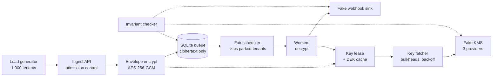
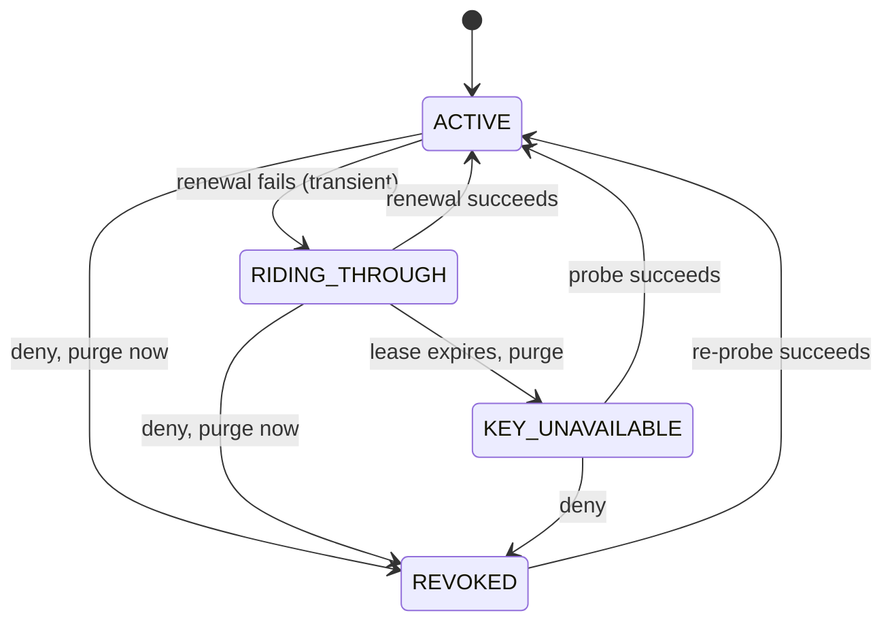

# Killswitch: CMEK event queue spec

2026-09-20 · @Ben

## Summary

Killswitch is a multi-tenant webhook event queue that encrypts every payload under the customer's own key (CMEK). It keeps two promises at once: a customer's kill switch works within a published bound, and nobody else's KMS failure can flip it for anyone else.

CMEK puts a third-party dependency that the customer controls into the hot path. The service must cache keys to survive KMS outages, yet every second of caching delays revocation. Killswitch makes that tradeoff one explicit knob, a **key lease**: cached keys are usable only while a time-bounded lease on the customer's authorization is valid.

A reviewer opens one URL and sees live traffic from 1,000 fake tenants spread across three fake KMS providers. They start a scenario (provider outage, key revocation, slow KMS, tenant surge, global surge) and watch a tenant grid, four charts, and a live invariant panel show the system degrading predictably. "Killswitch" is a working title.

## Constraints and success criteria

The plan is sized at 4 hours 45 minutes total, inside the assignment's 8-hour hard cap. Every assignment requirement maps to a concrete choice below.

| Assignment requirement | How this spec meets it |
| --- | --- |
| Deployed; usable in a browser or via API with no install | One Go binary on Cloud Run, scaled to zero when idle and capped at one instance; dashboard at the root URL; `POST /v1/events` works from curl |
| Self-contained evaluation | Fake tenants, traffic and KMS providers run in-process; each scenario card says what to watch |
| Target 1–2 hours, hard cap 8; scoping is graded | 4:45 plan with a cut line per milestone; stretch work starts only after P0 is live |
| Code on GitHub | Public repo; this spec exported to `docs/SPEC.md` |
| Rationale as a \~5 min video plus a short written doc | Drafted from Summary, The CMEK core, and the Decision log |
| AI transcripts; judgment is evaluated | Decision log records each call and who made it |
| Note time spent | Tracked per milestone in Plan and cut lines |

The submission succeeds if three things hold:

1. A reviewer with no CMEK background understands the thesis within 2 minutes of opening the URL.
2. Each scenario tells its story within 90 seconds, and the invariant panel stays green throughout.
3. The core package (`internal/cmek`) stays near 500 lines, small enough for Ben to read fully and defend on video.

## Scope

P0 is the smallest system that proves the thesis: one data path, the CMEK core, five scenarios, and a live checker. Everything else is ordered stretch work or an explicit non-goal.

| Area | P0 |
| --- | --- |
| Data path | Ingest API → envelope encryption (AES-256-GCM) → SQLite queue → fair round-robin scheduler → workers → fake sink |
| CMEK core | Key lease with soft and hard TTL, singleflight, error classification, tenant key state machine with backoff probes, key fetcher behind bulkheads, tenant parking |
| Admission | Per-tenant token bucket (429), per-tenant backlog cap, and a global backlog cap that sheds the heaviest tenants first (503) |
| Fakes | 3 KMS providers, 1,000 tenants with Zipf traffic, fault injection: fast-fail outage, latency, revoke and restore; surge controls per tenant and global |
| Scenarios | Provider outage, key revocation, slow KMS, tenant surge, global surge, no key cache (added 2026-09-23, docs/plan/NOCACHE.md: two runs that remove the lease and the DEK cache) |
| UI | Scenario cards, tenant grid, 4 charts, invariant panel, event timeline, reset |
| Checks | Live invariant checker; unit tests for the lease, classifier and envelope |
| World | One shared World with no globals; reset button; pause and auto-reset when nobody is watching |

Every term in this table is unpacked, row by row, in [P0 explained](file/fa225fcb-06cd).

Stretch items start only after P0 is deployed and smoke-tested. Each one ships independently. They are numbered X1 to X4 so they can't be confused with safety invariants S1 to S4.

| # | Stretch item | Estimate | Why this position |
| --- | --- | --- | --- |
| X1 | Naive-mode switch for the slow-KMS scenario: workers unwrap inline per message, with no lease, cache or bulkheads. **Built 2026-09-24**: the Slow KMS card's mode buttons switch the whole service live between Naive (no lease, cache or bulkheads), Sync fetch (cache and lease kept, the worker fetches inline) and Async fetch (the design that ships), plus `POST /v1/keyfetch` for curl; plans and numbers in [plan/NAIVE.md](plan/NAIVE.md) (the first, scripted form) and [plan/KEYFETCH.md](plan/KEYFETCH.md) (the buttons) | 20 min | The most persuasive moment: one slow KMS takes everyone down, then the switch brings them back |
| X2 | Per-session worlds | 45–60 min | Removes reviewer interference; cheap because World has no globals |
| X3 | Surge during a KMS brownout; KMS throttling (429) class; blackhole outage; cold start; key rotation; lease slider | 10–30 min each | Breadth; each is independent |
| X4 | Scenario tests in virtual time (`testing/synctest`) | 45 min | Turns the invariants into CI checks |

Non-goals: real webhook delivery (signing, endpoint retries), real KMS SDK integrations, multi-node or multi-region deployment, auth beyond a tenant header, durable restart recovery, and message ordering guarantees.

## Correctness contract

"Handles CMEK correctly" means four safety invariants that must never break, plus four isolation and overload SLOs that hold under every fault or surge. The UI shows each one live as a pass/fail light.

The checker sits outside the service's trust boundary. Because the KMS is a fake, it records ground truth (the exact moment a key was revoked), so the checker compares what truly happened against what the service did.

| ID | Statement | Live check |
| --- | --- | --- |
| S1 No plaintext at rest | A payload that can't be encrypted under its tenant's key is rejected. There is no fallback key and no plaintext write. | Every payload carries a canary string. The checker scans stored rows for it. Count must be 0. |
| S2 Tenant key isolation | A payload is only ever encrypted under a DEK wrapped by its own tenant's KEK. | AAD binds tenant, message and DEK IDs. The sink verifies payload tenant equals envelope tenant. |
| S3 Bounded revocation | After a key is revoked at time t, none of that tenant's payloads is decrypted after t + lease (30 s in the demo). An authoritative deny purges keys at once. | Checker counts decrypts later than ground-truth t + lease. Count must be 0. Detection latency is displayed. |
| S4 No loss from key unavailability | A transient key failure never drops a message, dead-letters it, or burns its retry budget. | Conservation per tenant: accepted = delivered + queued + expired + dead. |
| L1 Blast radius | During a fault or surge on some tenants, unaffected tenants keep p99 end-to-end latency within 1.25x of baseline and a rejection rate of 0. | Healthy-vs-affected p99 chart and an SLO light. |
| L2 KMS call economy | KMS calls per tenant are bounded by lease renewals (at most 1 per soft TTL) plus DEK rotations, whatever that tenant's request rate. | KMS calls/s charted against events/s; per-tenant call rate in the tenant detail. |
| L3 Self-healing | When a fault clears, affected tenants return to ACTIVE and backlog drains with no operator action and no call spike above the bulkhead cap. | Timeline events and a displayed recovery time. |
| L4 Overload | When offered load exceeds delivery capacity, delivered throughput holds at capacity and backlog stays bounded. Excess is rejected at ingest, heaviest tenants first. Tenants within their fair share see no rejections. | Delivered-against-capacity tile, backlog chart, and rejections split by tenants within and over their share. |

## Architecture

Everything runs in one Go process inside one `World` object: the service, the fakes, and the checker. Only one component, the key fetcher, ever talks to a KMS.



Solid arrows are the data path; dotted arrows are key lookups and checker reads.

1. **Ingest.** Check the global backlog cap, then the tenant's token bucket and backlog cap. Get the tenant's active DEK from the key lease: in memory if the lease is valid, otherwise one bounded synchronous key fetch. Encrypt with a fresh 96-bit nonce and AAD = tenant ID, message ID, DEK ID. Insert the row and return 202.
2. **Delivery.** The scheduler round-robins over tenants that have backlog, a valid lease, and the needed DEK in cache. Workers never call a KMS. If a DEK is missing, the scheduler asks the key fetcher for it and moves on to the next tenant.
3. **Key fetch.** The key fetcher applies a per-call timeout, singleflight per DEK, concurrency caps per provider and per tenant, and per-tenant backoff with jitter. Every call and every purge lands in the audit log.

The queue is the right substrate for this demo, and the rationale should say so. It separates encrypt time from decrypt time, so key state can change in between. That forces the service to own parking, retry and fairness instead of returning an error.

**Key hierarchy.** The customer's KEK lives in their KMS and never leaves it. It wraps a 256-bit DEK obtained through `GenerateDataKey`. The wrapped DEK is stored; the plaintext DEK exists only in memory under a valid lease, for at most 10,000 messages or 10 minutes.

| Store | Fields | Notes |
| --- | --- | --- |
| `deks` table | id, tenant\_id, kek\_id, kek\_version, wrapped\_dek, created\_at | Wrapped keys only, safe at rest |
| `messages` table | id, tenant\_id, dek\_id, nonce, ciphertext, state, attempts, enqueued\_at, claimed\_until | Index on (tenant\_id, state, id). States: ready, claimed, dead. Deleted on ack. |
| Audit log (in-memory ring) | ts, tenant\_id, op, kek\_version, outcome, class | Every KMS call, purge and state change |

## The CMEK core

The service holds a time-bounded lease on each tenant's key authorization, and cached DEKs are usable only while that lease is valid. Any successful KMS call for the tenant renews it. The lease length is both the revocation bound and the longest outage the tenant can ride through.

Renewal is an `Unwrap` of the tenant's active wrapped DEK, because that exercises the exact permission delivery depends on. Renewal is lazy: traffic or backlog triggers it once the lease passes its soft TTL. When the lease expires, the tenant's plaintext DEKs are purged.

Two details keep the bound strict. Lease validity is measured from when the renewal request was sent, not from when the response arrived, so an in-flight call can't stretch the bound by its own latency. The lease also expires locally 1 s early, so work that starts just before expiry finishes inside the bound.

| Parameter | Demo value | Production-like | Meaning |
| --- | --- | --- | --- |
| Lease (hard TTL) | 30 s | 5 min | The revocation bound and the maximum ride-through |
| Soft TTL | 15 s | 2.5 min | Lease age at which background renewal starts |
| KMS call timeout | 500 ms | 2–5 s | Deadline per call |
| Transient backoff | 0.5 s doubling to 8 s, ±50% jitter | 1 s to 60 s | Acts as the per-tenant circuit breaker; one probe at a time |
| Revoked re-probe | every 5 s | every 1 min | Detects a re-grant |
| DEK reuse limit | 10,000 messages or 10 min | similar | Bounds exposure per DEK |
| Retention | 10 min | 72 h | Parked messages expire after this |

All values are `World` parameters, so scenarios can be tuned without code changes.

### Down versus revoked

The same symptom, "can't unwrap", gets opposite treatment depending on who is speaking. A timeout is the network talking, so the service rides through. A deny is the customer talking, so the service obeys at once.

| KMS response | Class | Lease and cache | Ingest for that tenant | Delivery for that tenant |
| --- | --- | --- | --- | --- |
| Success | OK | Renew lease | 202 | Deliver |
| Timeout, connection error, 5xx | Transient | Keep until the lease expires; retry with backoff | 202 while the lease is valid, then `503 key_unavailable` with Retry-After | Deliver while valid, then park |
| AccessDenied, KeyDisabled | Authoritative deny | Purge the tenant's DEKs now | `403 key_revoked` | Park; re-probe; retain messages until retention |
| AES-GCM tag failure (local) | Poison | No change | n/a | That one message goes to dead |

An unreachable KMS is indistinguishable from a customer unplugging a self-hosted key manager. That is why ride-through has a hard cap, and why the cap is the published SLA. A deny never counts as a dependency failure, so it never feeds the backoff logic.



RIDING\_THROUGH has no customer impact; KEY\_UNAVAILABLE and REVOKED fail closed and park the tenant. The grid colors map one-to-one to these four states.

### Isolation

| Mechanism | What it contains |
| --- | --- |
| Workers never call a KMS; the scheduler only dispatches tenants whose key is hot | A slow KMS can't absorb the shared worker pool |
| Key fetcher bulkheads: 32 in flight per provider, 2 per tenant, singleflight per DEK | A slow provider can't starve other providers' fetches; a tenant can't spam its own KMS |
| Bounded waiters on the ingest cold path: 4 per tenant, then a fast 503 | Slow key fetches can't pile up ingest handlers |
| Per-tenant backoff with jitter; single probe when half-open | No retry storm against a struggling KMS; no thundering herd at recovery |
| Parking at tenant level | A parked tenant costs zero worker time, and its messages keep their retry budget |
| Per-tenant token bucket and backlog cap; round-robin scheduler | A surging tenant can't flood the queue or starve other tenants' delivery |
| Global backlog cap that sheds tenants above their fair share first | A surge from everyone slows the few heaviest senders, not the many light ones, and total backlog stays bounded |

## Fakes and scenarios

The fakes are honest stand-ins: the fake KMS does real cryptography and keeps ground truth, and the traffic exercises the same code path as the HTTP API.

| Fake | What it models |
| --- | --- |
| KMS | The interface a real adapter would implement: one remote AEAD per KEK (`KEK(kekID)` returning a `tink.AEADWithContext` whose encrypt and decrypt are the wrap and unwrap round trips; amended from `GenerateDataKey` and `Unwrap` by the Tink adoption, 2026-09-23). Three simulated providers (labelled aws, gcp, azure) each host a third of the tenants. Real AES-256-GCM wrapping via tink-go under per-tenant KEKs, so a revoked key is truly unusable. |
| KMS faults | Per provider or per tenant: mode (ok, fast-fail), lognormal latency (p50, p99), error rate, key state (enabled, disabled). |
| KMS ground truth | A timestamped log of every call and every key state change. Only the invariant checker reads it. |
| Traffic | 1,000 tenants with Zipf-distributed rates, about 300 events/s in total. Payloads are \~1 KB synthetic webhook events containing the canary `PLAINTEXT-CANARY-<tenant>`. Surge controls multiply one tenant's rate or every tenant's rate. Rejections are counted by reason and not retried. |
| Sink | Accepts deliveries with 5–20 ms simulated latency, verifies the canary's tenant, and records delivery time. Worker count times sink latency sets a synthetic capacity, so behavior doesn't depend on the host's CPU. |

Each scenario is a scripted fault or surge with a card that tells the reviewer what to watch.

| Scenario | Fault | What to watch | Exercises |
| --- | --- | --- | --- |
| Provider outage | Provider gcp fast-fails. Two buttons: a 10 s blip and a 60 s outage. | Blip: a third of the grid turns yellow, then green; no chart moves. Outage: yellow spreads over 0–15 s with no customer impact. From 15–30 s leases run out at staggered times, cells turn orange, and those tenants get 503s. The other two providers' tenants stay flat. Calls to gcp decay through backoff. On restore, cells go green within about 10 s and parked messages deliver. | S1, S4, L1, L3 |
| Key revocation | Disable the key of one high-traffic tenant. | One cell turns purple, typically within 15 s and always within 30 s. The timeline shows revoked (ground truth), detected, DEKs purged, and 0 decrypts after. Ingest returns `403 key_revoked`. Click Restore: the re-probe sees it within 5 s and the parked messages deliver. | S3, S4, L1 |
| Slow KMS | Provider azure latency rises to p50 400 ms and p99 3 s against a 500 ms timeout. | Azure tenants flicker yellow; cold ones see slow ingest and some 503s. The healthy-tenant p99 line stays flat. Key-fetcher in-flight for azure pins at its cap of 32 while the other providers' fetches run freely. | L1, L2 |
| Tenant surge | One top-20 tenant sends 100x its normal rate for 60 s. | Its cell stays green, marked with a ring. Above its limit of 100 events/s it gets 429 rate\_limited. Its KMS calls stay flat, at most 1 per 15 s, while its traffic is 100x. Other tenants' p99 and delivery lag don't move, because the scheduler gives every tenant one turn per round. | L1, L2 |
| Global surge | Every tenant sends 5x for 60 s: about 1,500 events/s offered against a delivery capacity near 640. | Delivered throughput holds at capacity instead of collapsing. A few dozen of the heaviest tenants are held to their fair share and see 429s. The rest notice nothing. Backlog rises, then levels off under its caps, and drains within about a minute after the surge. KMS calls per second stay under the bound of 1,000 tenants ÷ 15 s, about 67. | L1, L2, L4 |
| No key cache (added 2026-09-23) | Tenants run without the lease and the DEK cache: every event is one KMS call to seal and one to deliver, with every provider at a realistic 20 ms so only the cache differs. Two buttons: one band + blip (gcp loses the cache for 55 s, the 10 s gcp blip in the middle) and everyone + surge (all tenants lose it for 90 s, the 5x global surge from 15 s). | Band run: KMS calls/s ×6, the affected p99 line 40–100 ms above the healthy one, in-flight gcp rising; the blip parks all 333 gcp cells orange within a second with 503s, nothing lost. Global run: delivered drops below the baseline load before any surge, then stays pinned far under capacity while KMS calls reach ~1,700/s, in-flight hits the bulkheads, cells go orange in every band and the backlog hits its cap. L2 red in both; L1 and L4 red in the global run. | Why the cache and the lease exist: call economy, latency off the request path, ride-through. |

The two surge scenarios depend on four load settings, all World parameters.

| Load setting | Demo value | Effect |
| --- | --- | --- |
| Delivery capacity | 8 workers at 12.5 ms mean sink latency, about 640 events/s | Roughly twice the 300 events/s baseline |
| Tenant rate limit | 100 events/s, burst 200 | Above it: `429 rate_limited` |
| Tenant backlog cap | 500 messages | Above it: `429 backlog_full` |
| Global backlog cap | 20,000 messages | Above it, tenants over their fair share of the backlog get `503 overloaded` |

Once the lease expires, ingest for that tenant is rejected rather than queued, because a symmetric DEK that can encrypt can also decrypt. Parked backlog is therefore small: the messages in flight when the lease ran out. Removing that limit is the first item under With more time.

## Web UI

The UI is one page with one hero visual: a 1,000-cell tenant grid that makes blast radius something you can see. It is a single HTML file with vanilla JS and uPlot, embedded in the binary, with no build step.

| Region | Contents |
| --- | --- |
| Header | Three sentences on what CMEK is and the thesis; a notice that this is a shared live system; Reset |
| Scenario cards (left) | Title, what to watch, Start and Stop, and a phase countdown while running |
| Tenant grid (center) | 40 × 25 canvas, banded by provider so an outage lights one contiguous band. Green ACTIVE, yellow RIDING\_THROUGH, orange KEY\_UNAVAILABLE, purple REVOKED. A ring marks any tenant a scenario targets. Hover shows tenant, provider, lease remaining and backlog. Click pins a detail strip with the tenant's last 10 audit entries. |
| Tiles | Events delivered per second against capacity, healthy-tenant p99, KMS calls per second, tenants by state |
| Charts (2-minute window) | 1. Ingest outcomes per second: accepted, 429, 503 key\_unavailable, 503 overloaded, 403 key\_revoked. 2. End-to-end p99: healthy versus affected tenants. 3. KMS calls per second by class, against events per second. 4. Backlog: total and affected set. |
| Invariant panel | S1–S4, L1 and L4, each with a light, a counter and a last-checked time |
| Event timeline | State transitions and scenario markers, newest first, such as `12:01:07 t-0042 REVOKED, detected in 8.2 s, 3 DEKs purged` |

The server pushes one JSON snapshot over SSE at 2 Hz: global aggregates, a 1,000-byte state array for the grid, and new timeline events. That is a few KB per tick. The World runs only while a viewer's stream is open, which is also the only time Cloud Run allocates CPU. The first connection after more than 10 s without viewers builds a fresh World, and the page shows a starting state until the first snapshot arrives.

## Stack, API and deployment

The whole system is one static Go binary with the UI embedded, deployed as a single container that scales to zero when idle. That keeps deployment risk small and gives real concurrency, real timeouts and real crypto.

| Choice | Decision | Reason |
| --- | --- | --- |
| Language | Go, current stable | Goroutines and `context` deadlines map directly onto timeouts, bulkheads and worker pools |
| Storage | `modernc.org/sqlite`, WAL mode, single writer connection | Pure Go, so no CGO and a simple static build; "at rest" stays tangible |
| Libraries | stdlib `net/http`; `tink-go` for all cryptography (amended 2026-09-23, docs/plan/TINK.md: it replaced our own `crypto/aes`/`crypto/cipher` envelope and KEK wrapping); `x/sync/singleflight`; `x/time/rate` | A vetted library for the part that must not be wrong; little to review beyond our own code elsewhere |
| UI | `index.html`, vanilla JS, uPlot, served through `go:embed` | No npm, no build step |
| Hosting | Cloud Run, scaled to zero: min 0 and max 1 instance, request-based billing, startup CPU boost, 60-minute request timeout, 1 GiB memory | Max one instance keeps the World in a single process. The World only needs CPU while someone is watching, and an open stream is an in-flight request, so [request-based billing](https://docs.cloud.google.com/run/docs/configuring/billing-settings) fits and idle time costs nothing. The price is a short cold start on the first visit, softened by [startup CPU boost](https://docs.cloud.google.com/run/docs/configuring/services/cpu). The [filesystem is in-memory](https://docs.cloud.google.com/run/docs/container-contract), so SQLite counts against instance memory. Streams end at the [request timeout](https://docs.cloud.google.com/run/docs/configuring/request-timeout), so the UI reconnects by itself. |

```
cmd/killswitch/     HTTP server, embeds the UI, owns the World
internal/world/     wires everything; parameters; Reset
internal/cmek/      lease, DEK cache, classifier, key fetcher, envelope (the core)
internal/kms/       KMS interface, fake providers, fault injection, ground truth
internal/queue/     SQLite store, fair scheduler, workers
internal/admit/     token buckets, backlog caps
internal/traffic/   load generator, fake sink
internal/check/     invariant checker
internal/metrics/   aggregates, histograms, SSE snapshot
web/                index.html, app.js, uPlot
```

| Endpoint | Purpose |
| --- | --- |
| `POST /v1/events` with header `X-Tenant-ID` | Enqueue an event. Returns 202, 429 (`rate_limited`, `backlog_full`), 503 (`key_unavailable`, `overloaded`) or 403 (`key_revoked`) |
| `GET /v1/stream` | SSE snapshots at 2 Hz |
| `POST /v1/scenarios/{name}/start` and `/stop` | Run or stop a scripted scenario |
| `POST /v1/faults` | Manual fault injection: scope (provider or tenant), mode, latency, error rate |
| `POST /v1/traffic` | Manual surge control: a rate multiplier for one tenant or for all tenants |
| `POST /v1/tenants/{id}/key` | Body `{"action": "revoke"}` or `{"action": "restore"}` |
| `GET /v1/tenants/{id}` | Tenant state, lease age, backlog, recent audit entries |
| `POST /v1/reset` | Rebuild the World |
| `GET /healthz` | Liveness |

Testing stays proportionate. Table-driven unit tests cover the classifier, the lease (renewal, soft and hard expiry, purge on deny) with an injected clock, and the envelope (round trip; AAD mismatch must fail). The live invariant checker doubles as the integration test on every deploy.

## Plan and cut lines

The 4:45 splits into 3:40 of build, 0:45 of rationale and 0:20 of buffer. Deployment happens in the first 20 minutes, so the riskiest external dependency is retired before any feature work.

| Milestone | Clock | Output | If it overruns, cut |
| --- | --- | --- | --- |
| M0 Skeleton and deploy | 0:00–0:20 | Repo, empty World, `/healthz`, static page, Dockerfile, live URL on Cloud Run, plus a check that a background ticker keeps running while a stream is open | Nothing |
| M1 Data path | 0:20–1:05 | Fake KMS with real wrapping, envelope, SQLite queue, scheduler, workers, sink, load generator, SSE with raw counters | Tenant detail endpoint |
| M2 CMEK core | 1:05–1:50 | Lease, classifier, key state machine, key fetcher with bulkheads, parking, fault API, unit tests | Per-tenant fetch cap (keep per-provider) |
| M3 Admission and surges | 1:50–2:20 | Token buckets, tenant backlog cap, global fair-share shedding, surge controls, both surge scenarios scripted | Fair-share shedding (fall back to a plain global cap) |
| M4 UI and scenarios | 2:20–3:15 | Grid, tiles, 4 charts, scenario cards, timeline; five scenarios tuned to read within 90 s each | Hover and pinned detail; drop to 2 charts |
| M5 Checker and hardening | 3:15–3:40 | Invariant panel, reset, idle pause, README, final deploy, clean-browser smoke test | L1 and L4 lights (keep S1, S3, S4) |
| M6 Rationale | 3:40–4:25 | Short written doc drawn from this spec; 5-minute video | Second video take |
| Buffer | 4:25–4:45 |  |  |

Stretch items X1 and X2 add a little over an hour, which lands near 6 hours, still under the cap.

| Risk | Mitigation |
| --- | --- |
| Scope creep past 4:45 | Cut lines above; stretch only after P0 is deployed and smoke-tested |
| The demo is hard to read | One hero visual, cards that say what to watch, five short scenarios |
| Scenario timing reads badly | All time constants are World parameters; tune them in M4 |
| Two reviewers collide in the shared World | Banner, reset, auto-reset when idle; X2 if time allows |
| A small instance makes behavior noisy | Capacity is synthetic (workers × sink latency), not real CPU saturation |
| Reads as AI-generated with no judgment | Ben reads and owns `internal/cmek` end to end; the decision log and transcripts show who decided what |
| SQLite write contention | WAL, a single writer connection, batched lease and ack |
| Request-based billing throttles CPU whenever no request is in flight | The World runs only while a stream is open, and M0 verifies that on the live service. Fallback: min 1 instance with instance-based billing |

## With more time

The most valuable extension removes the KMS from the write path entirely; the rest move the toy toward production. These are for the rationale, not the build.

| Extension | Why it matters |
| --- | --- |
| Write path independent of the KMS | Wrap each DEK with the tenant's public key (HPKE or RSA-OAEP). Ingest then needs no KMS call and holds no decrypt capability, so a KMS outage only pauses delivery and the backlog is kept instead of rejected. |
| Real KMS adapters behind the same interface | AWS KMS, Cloud KMS and Key Vault differ in error semantics and in their own revocation propagation delay, which adds to any end-to-end SLA. |
| Multi-node leases | Leases are per process. A fleet needs a purge broadcast or a shared deny list so that one node's detection revokes everywhere. |
| Customer-facing key health and audit export | Caching reduces what customers see in their own KMS logs, so the provider's audit trail has to fill that gap. |
| Key rotation and crypto-shredding | Background re-wrap of DEKs on rotation; proof at retention that expired data is unrecoverable. |
| Deterministic simulation testing | Virtual time, randomized fault schedules, and the invariants as properties. |
| Real broker backends | Kafka, SQS or Pub/Sub with the envelope carried in message headers. |
| DEK memory hygiene | Zeroization, locked memory, or holding DEKs inside an enclave. |

## Decision log and open questions

All nine decisions are settled, including one proposal of Claude's that Ben declined (D8). This table doubles as source material for the written rationale.

| # | Decision | Who | Why |
| --- | --- | --- | --- |
| D1 | Theme 3: a CMEK-compliant event queue with fake traffic and a fake KMS | Ben | Matches the role's "key management & encryption" scope; a real problem with real failure modes |
| D2 | Center the project on revocation versus availability; revocation is a first-class scenario | Claude proposed, Ben accepted | It is what separates CMEK from generic resilience work |
| D3 | Go | Ben | Concurrency primitives map onto the mechanisms; single binary |
| D4 | A real service in real time with compressed time constants; one shared World in P0, per-session worlds as a follow-up | Ben | Reads as a system rather than a simulation |
| D5 | 4-hour total budget; lean P0 with three scenarios (amended by D8: five scenarios, 4:45 total) | Ben | Closest to the 1–2 hour target; scoping is graded |
| D6 | Build the queue directly on a SQLite table; no separate store-on-disk phase | Claude proposed, Ben accepted | One step instead of two; "at rest" stays tangible |
| D7 | Stub webhook delivery with a fake sink | Claude proposed, Ben accepted | Endpoint failures are a webhook problem, not a CMEK one |
| D8 | Single-tenant and global surge move from the core to stretch (S1, S4) | Claude proposed; Ben declined | Ben keeps both surge scenarios in P0, as in his original brief. This adds about 45 minutes, so the plan is now 4:45 |
| D9 | Host on Cloud Run, scaled to zero: at most one instance, request-based billing, a short cold start accepted | Ben | Ben's choice of host, and of near-zero idle cost over a warm start. It fits because the World lives in one process and already pauses when nobody is watching |
|  |  |  |  |

- [x] Confirm D7 and D8, or push back.
- [x] Stretch order: per-session worlds is X2, behind the naive-mode switch, now that D8 moved the tenant surge into P0. Claude first said it would be the first stretch item, before the budget was set.
- [x] Name: keep "Killswitch"?
- [x] Hosting: Fly.io is the default. Any account you already have works if it stays always-on.
- [x] Does spec and planning time count toward the 4:45? The plan assumes it does not.
- [x] Demo lease length: 30 s keeps every scenario under 90 s. A shorter lease reads faster but makes the yellow ride-through phase easy to miss.

## Prior art

Shipping CMEK products make the same tradeoffs this spec makes, which supports the claim that the problem is real. Each page below was read on 2026-09-20.

| Source | What it documents | Relevance here |
| --- | --- | --- |
| [MongoDB Atlas: encryption at rest with customer key management](https://www.mongodb.com/docs/atlas/security-kms-encryption/) | Validates the KMS configuration every 15 minutes. Shuts processes down at the next check if the key is disabled or deleted, but not when it merely can't connect to the provider. | A lease-like revocation bound, and the same down-versus-revoked split |
| [AWS Encryption SDK: cache security thresholds](https://docs.aws.amazon.com/encryption-sdk/latest/developer-guide/thresholds.html) | Maximum age is required; maximum messages and bytes are optional. Guidance is to use the shortest age that still benefits, and to evict keys "whose policies might have changed." | Our lease and DEK reuse limits |
| [Amazon S3 Bucket Keys](https://docs.aws.amazon.com/AmazonS3/latest/userguide/bucket-key.html) | A time-limited bucket-level key cuts KMS request costs by up to 99 percent. Customers then see fewer KMS CloudTrail events. | KMS call economy, and the audit-granularity cost of caching |
| [Cloud KMS resource consistency](https://docs.cloud.google.com/kms/docs/consistency) | A disabled key version typically stays usable for up to 1 minute, and for several hours in exceptional cases. | The provider's own propagation delay adds to any end-to-end revocation SLA |
