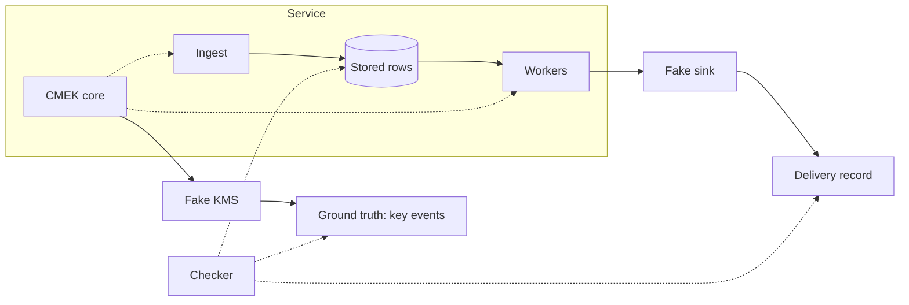

# Killswitch architecture

Killswitch is a multi-tenant webhook event queue that encrypts every payload under the customer's own key and keeps two promises at once: the customer's kill switch works within a published bound (S3), and nobody else's KMS failure can flip it for anyone else (L1). Everything runs in one process inside one World object: the service, the fakes it is measured against, and a checker that grades the service from outside its trust boundary.

This is the ten-minute view. It does not repeat SPEC.md: where the spec already says it, this document cites the section and adds only what the architecture adds. Signatures, parameters, SQL and concurrency rules live in DESIGN-REFERENCE.md, which every milestone plan cites.

## Components

These are the components, and one rule shapes all of them: only the key fetcher ever talks to a KMS, and workers never wait on one.

| Component | Responsibility |
| --- | --- |
| Ingest API | The single front door for HTTP and the load generator alike: admission, key, seal, insert, then 202 or one rejection code. |
| Envelope | Seals and opens payloads under a per-tenant data key (DEK). The authenticated data binds tenant, message and DEK identity, so a ciphertext moved to another tenant's row fails to open (S2 by construction). |
| Queue | Ciphertext rows plus a per-tenant ledger. Rows are claimed with a deadline, acknowledged on delivery, and released on any key problem with their retry budget untouched (S4). |
| Scheduler | A fair ring over tenants that have ready rows and a hot key. Parked tenants are skipped and cost no worker time. |
| Workers | A fixed pool that decrypts with cached DEKs and delivers. A missing key is handed to the core and the batch is released. |
| Key lease and DEK cache (the CMEK core) | One lease, one DEK cache and one four-state key machine per tenant. Decides whether a tenant may encrypt, may decrypt, or is parked. |
| Key fetcher | The only KMS caller: per-call deadlines, coalesced fetches per key, caps on calls in flight per provider and per tenant, per-tenant backoff probes. Every call and purge is audited. |
| Admission gate | Global backlog cap with fair-share shedding, then a per-tenant token bucket, then a per-tenant backlog cap. |
| Fakes | Three KMS providers doing real wrapping, with fault injection and a ground-truth log; 1,000 Zipf-distributed tenants of traffic; a sink that verifies each payload's tenant and stamps delivery time. |
| Scenarios | Scripted fault or surge phases owned by the World. Each declares its target set up front and ends with a tail that measures recovery and drain. |
| Checker | Re-verifies S1–S4 every second from sources the service does not write, and judges the L1 and L4 SLO lights from service aggregates. |
| Metrics and stream | Aggregates, the tenant grid, the timeline and the verdicts, pushed to the page as periodic snapshots. |

## The data path

The pipeline is the spec's (SPEC › Architecture): ingest → envelope → queue → scheduler → workers → sink, with the core consulted at both ends and the fetcher behind it. The queue separates encrypt time from decrypt time, so key state can change in between; that is what forces the service to own parking, retry and fairness instead of returning an error. Three rules the spec leaves open are fixed here.

1. **Ingest spends nothing before admission.** A parked tenant is rejected without any KMS call. A cold tenant pays one bounded synchronous fetch, and only a few requests may wait for it; the rest get a fast 503.
2. **The lease is checked twice on delivery**: when a tenant is picked (only hot tenants are dispatched) and again per message at decrypt time. If the key has gone in between, the remaining rows go back untouched: nothing is decrypted after the bound (S3) and no attempt is burned (S4). A DEK that is merely not in memory costs one claim-and-release; the tenant is not hot again until its unwrap succeeds or is denied.
3. **Every KMS answer is classified once**, in the fetcher: OK renews the lease, a transient failure schedules a backoff probe, an authoritative deny purges the tenant at once. Renewal is an unwrap of the tenant's active wrapped DEK, the exact permission delivery depends on.

## The key lease and the four states

Lease semantics (soft and hard TTL, lazy renewal, validity measured from send time, early local expiry, the key hierarchy) are SPEC › The CMEK core. The four states and the down-versus-revoked rule are SPEC › Down versus revoked. The architecture adds three rules the spec does not state.

- An idle tenant whose lease lapses without any failure stays ACTIVE with its plaintext purged; its next event pays one synchronous fetch. If that fetch fails transiently, the tenant goes straight to KEY_UNAVAILABLE, which is why a provider blip shows a few orange cells among the yellow band.
- While RIDING_THROUGH, a DEK that has reached its reuse limit keeps sealing; rotation resumes when the tenant is ACTIVE again, so ride-through stays customer-invisible.
- A local authentication failure on one message is poison: that message alone is dead-lettered and the tenant's state does not change.

## Isolation

The mechanisms are SPEC › Isolation. Each exists to contain one specific failure, and every mechanism has a scenario that shows it working; the scenario column is what the spec's table lacks.

| Mechanism | Scenario that shows it |
| --- | --- |
| Workers never call a KMS; only hot tenants are dispatched | Slow KMS (L1) |
| Per-provider and per-tenant caps on calls in flight; coalesced fetches per key | Slow KMS (L1, L2) |
| Bounded waiters on the ingest cold path, then a fast 503 | Slow KMS, provider outage |
| Per-tenant backoff with jitter; one probe in flight per tenant | Provider outage (L3) |
| Parking at tenant level | Provider outage, key revocation (S4) |
| Per-tenant token bucket and backlog cap; a fair scheduler that bounds every tenant's wait | Tenant surge (L1, L2) |
| Global backlog cap that sheds tenants above their fair share first | Global surge (L4) |

## Admission and fairness

Status codes say whose problem it is (P0_EXPLAINED › 429 versus 503 versus 403); `503 overloaded` adds a fourth answer: the service as a whole is full and you are over your share. Checks run cheapest first: global cap, token bucket, tenant backlog cap, then the key.

Fair share is the global cap divided by the number of tenants that currently hold backlog. When the total is at the cap, only tenants holding more than their share are rejected, so the light majority sees no rejection (L4). M3 decides whether the global surge runs longer than the card's 60 s or the cap is lowered, so that `503 overloaded` is visible at all.

Delivery-side fairness is the scheduler's job. A one-turn-per-tenant ring is fair in turns but not in latency: during the global surge every heavy tenant carries a full batch, and a light tenant's single message waits behind all of them. The ring therefore interleaves two classes, within-share and over-share, giving the light class most of the turns while staying work-conserving and bounding every heavy tenant's wait. That is what lets the global-surge card say the rest notice nothing.

## The trust boundary

The checker proves the contract from evidence the service cannot influence. A dashboard of a working system proves little; a checker that could turn red is what makes the claims falsifiable.

The core sees the KMS only through the interface a real adapter would implement. Ground truth and the delivery record are reachable only by the checker; stored rows are read directly, not through the service's account of them.

| Check | What the checker reads | Why the service cannot fake it |
| --- | --- | --- |
| S1 No plaintext at rest | A periodic full scan of stored rows for the canary every payload carries | The rows themselves |
| S2 Tenant key isolation | The sink's count of deliveries whose payload named another tenant | The sink verifies plaintext on arrival |
| S3 Bounded revocation | The ground-truth revoke time against the sink's delivery timestamps. The window closes at the ground-truth restore, so a draining backlog is never counted against the bound | Neither timestamp is written by the service |
| S4 No loss | Per tenant, accepted = delivered + queued + expired + dead, taken in one consistent snapshot, with the service's own delivered count bounded by the sink's independent count | Row counts come from the table; the sink bound is the one part of S4 the service cannot influence |
| L1, L4 | Healthy-tenant p99 against a baseline frozen before the scenario starts; delivered rate against measured capacity; rejections by share class | These read service aggregates and are the honest exception: SLO lights, not safety invariants |

Three notes keep those verdicts honest.

- Ground truth stamps a revoke at the first instant a call can be denied, so no successful call can postdate it and the S3 count is exact, not approximate.
- L1 judges a target set that each scenario declares up front, against a baseline frozen before it starts. A set derived from tenant state would be circular for outages and wrong for surges, where the surging tenant stays ACTIVE. Manual fault and traffic endpoints never touch the set.
- L2 and L3 are shown, not judged: KMS calls per second are charted against events per second, and recovery time is measured by the scenario tail, which ends when every target is ACTIVE again and the affected backlog is empty.

## World lifecycle on Cloud Run

D9 hosts the service as one instance with request-based billing, so the process gets CPU only while a request is in flight. The architecture bends to that in three ways.

- **An open stream is the request.** The World runs only while a viewer's snapshot stream is open; the load generator pauses when the last viewer leaves and resumes when the first arrives. M0 verifies on the live service that a background ticker keeps running under an open stream; if it does not, the fallback is an always-on instance with instance-based billing.
- **No timers for idleness.** Nothing polls for idle, because without a request there is no CPU. The rule is applied at the next connect: a stream arriving after the idle threshold with no viewers gets a fresh World, so a reviewer never opens the link to find someone else's leftover outage. Reset does the same unconditionally.
- **Reset waits a bounded time for requests already in flight, then rebuilds.** Streams end at or just before the platform's request limit and the page reconnects on its own; whether the server ends them early is M5's stream-lifetime decision.

The World has no globals (P0_EXPLAINED › World). That is why Reset is cancel-and-rebuild, why a test can run two Worlds side by side, and why per-session worlds (X2) stay cheap.

## Packages and ownership

The layout is the spec's (SPEC › Stack, API and deployment). Two rules it enforces:

- `internal/cmek` depends on nothing but the KMS interface, so Ben can read and defend it on its own, and no fake, fault or ground truth is reachable from it.
- Only `internal/world` wires packages together; every other package is a leaf or a consumer of small interfaces it declares itself, which is what lets a test build a World with a fake clock and no HTTP.

| Package | Owner |
| --- | --- |
| `internal/cmek` | Ben writes or line-reviews every line |
| `internal/queue` | Claude; Ben reviews claim, release and the scheduler's next-tenant rule |
| `internal/kms` | Claude; Ben reviews the interface and the fake's revoke ordering |
| `internal/world` | Claude; Ben reviews ingest, wiring and the World holder |
| `internal/check` | Claude; Ben reviews the verdict rules |
| `internal/admit`, `internal/traffic`, `internal/metrics`, `cmd/killswitch`, `web/` | Claude |

## Cut lines and what they cost

The cut lines are the spec's (SPEC › Plan and cut lines) and are pre-agreed. This is what each one removes from the picture above, so the trade is visible before it is taken.

| Cut | What the architecture loses |
| --- | --- |
| M1: tenant detail endpoint | Hover and pin have no data source; the grid still colours from the snapshot |
| M2: per-tenant fetch cap | The isolation row "a tenant cannot spam its own KMS" rests on the provider cap and coalescing alone |
| M3: fair-share shedding | The global cap rejects every tenant above it; L4's "tenants within their share see no rejections" cannot hold, and the scheduler has no share class to interleave on |
| M4: hover and pinned detail; two charts | Tenant detail stays reachable by curl; the isolation proof rests on the p99 chart alone |
| M5: L1 and L4 lights | The panel proves S1–S4 only; L1 and L4 are read from the charts by eye |
| D9 fallback: always-on instance | Idle time costs money; nothing else changes, because the World already pauses when nobody is watching |

## Decisions for Ben

A decision is listed here only if choosing the alternative changes a promise in the correctness contract or a row of the isolation table. The body above assumes the recommended option; each bullet gives the alternative, its consequence, and the milestone bullet, under the same title, that carries the detailed form.

- **Scheduler class** (M3 › Decisions for Ben › Scheduler class). Alternative: the spec's literal one-turn-per-tenant ring. Consequence: healthy p99 rises to a full ring pass during the global surge, L1 goes red, and the card can no longer say the rest notice nothing.
- **DEK rotation during ride-through** (M2 › Decisions for Ben › DEK rotation during ride-through). Alternative: enforce the reuse bound strictly and reject at the boundary during an outage. Consequence: heavy tenants turn orange sporadically mid-outage, which the outage card would have to explain.
- **Provider bulkhead full** (M2 › Decisions for Ben › Provider bulkhead full). Alternative: fail fast when a provider's in-flight cap is full instead of waiting inside the call deadline. Consequence: a slow provider's cold tenants are rejected at once rather than after a bounded wait, and the slow-KMS card must describe rejections instead of a pinned in-flight count.
- **Stale-OK guard** (M2 › Decisions for Ben › Stale-OK guard). Alternative: drop the guard against a late success that the KMS checked before the revoke. Consequence: a REVOKED tenant can briefly un-park; S3 still holds, but "purge at once" is visibly violated and the README has to say so.

Every other decision (about fifty, each with its plan delta) is in the milestone plans and indexed in COVERAGE.md § 11.

Detail: DESIGN-REFERENCE.md (signatures, SQL, every parameter with its demo default, concurrency rules, the twenty design questions), ARCH-NOTES.md (corrections that override it), M0.md–M6.md (per-milestone plans) and COVERAGE.md (every spec item and decision mapped to its milestone).
