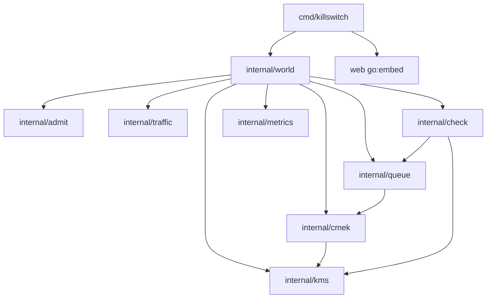

# Design reference (detailed architecture)

This is the detailed companion to ARCHITECTURE.md (the high-level document). The milestone plans cite this file as "DESIGN-REFERENCE.md › section" and by the shorthand "ARCH › section". Canonical v2. Base: v1 (proposal A with grafts from B and C) plus the dispositions of the adversarial review (safety-concurrency SC-F1–F11, spec-fidelity SF-F1–F17, buildability BB-01–BB-14; see the Review log appendix). Changes from v1 are marked `[SC-Fn]`, `[SF-Fn]`, `[BB-nn]` where they land. Module `github.com/prabenzo/cmek`, binary `cmd/killswitch`, Go 1.26 (go.mod `go 1.26`; see ARCH-NOTES 3 and the amendments list below). Spec IDs: S1–S4, L1–L4, D1–D9, X1–X4, M0–M6. Owner marks: **B** = Ben writes or line-reviews, **C** = Claude drafts at Ben's direction.

## Amendments made by the milestone plans

The milestone plans (M0.md–M6.md) are written against this reference and amend it in the places below; where they differ, the plan wins. Each plan marks its amendments inline as "amends ARCH".

| Area | Amendment | Plan |
| --- | --- | --- |
| Toolchain | `go 1.26` in go.mod and `golang:1.26` in the Dockerfile (the pinned `x/sync`/`x/time` require 1.26) | ARCH-NOTES 3, M0 |
| Deploy | Full `gcloud run deploy` command with `--allow-unauthenticated`, `--cpu-throttling`, `--port 8080`; Artifact Registry image; cross-compiling builder stage | ARCH-NOTES 1, M0 |
| Embedding | `//go:embed` in `web/embed.go` (`package web`, `var Files embed.FS`); `cmd/embed.go` is one `FileServerFS` line | M0 |
| M0 ticker | `KS_TICK_BURN_MS` (default 50) busy-burn per tick so the Cloud Run check discriminates; `World.Health(now, viewers)` in M0 only | M0 |
| World | `Deps{ID, Clock, Logger}` (the Holder passes `w-<seq>`); `Params.DBPath` becomes the directory `DBDir` (file `<DBDir>/killswitch-<pid>-<ID>.db`); `Params.SyncMode`, `WALAutocheckpoint` (env `KS_SYNC`, `KS_WAL_AUTOCHECKPOINT`); `NewHolder(p Params, d Deps)`; `World.IngestID` returns the message id for the 202 body; `Holder.Current()` returns `(w, release)` | M1, M5 |
| cmek | `Config.Nonce` deleted: `Seal` reads `crypto/rand.Reader` directly | M1 |
| Ownership | From M2 on (Ben, chat 2026-09-22) Claude writes every file and every test; the per-package "B" marks below and in the milestone plans read "Claude writes, Ben reviews" with the review scope of ARCH-NOTES 9 unchanged | M2–M6 |
| Tink as built | tink-go v2.8.0 does every byte of cryptography ([TINK.md](TINK.md), branch `claude/tink-go`, PR #8 plan approved 2026-09-23): `kms.KMS` is `KEK(kekID) (tink.AEADWithContext, error)`, one remote AEAD per KEK, and `DataKey`/`GenerateDataKey`/`Unwrap` are gone; the fake keeps its gate (fault → fast-fail / error rate / latency raced with ctx → enabled read after the latency) in front of a per-KEK Tink AES-256-GCM primitive and answers a blob that does not verify with `AccessDenied`; the fetcher wraps a fresh `AES256GCMNoPrefixKeyTemplate` keyset with `keyset.WriteWithContext` (the `generate` call) and unwraps with `keyset.ReadWithContext` (the `unwrap` call), AAD = KEK id; a cached DEK is the `tink.AEAD` (`dek.prim`, nil while cold) and `Handle{DEKID, ValidUntil, prim}`; `Handle.Zero` drops the reference (Tink offers no zeroization: plaintext DEKs are dropped on purge and collected, never wiped); `Envelope{DEKID, Ciphertext}` with the IV embedded (12 + n + 16 bytes) and no `nonce` column; the keyset helpers flatten the adapter's error with `%v`, so `Classify` falls back to `kms.CodeFromText` (the one sanctioned string match; `TestCodeThroughTink` runs real Tink against the gate so a changed shape fails the unit tests); `internal/cmek` imports `tink-go/v2/{aead,keyset,tink}` and never `insecurecleartextkeyset`; the CI import regex allows `tink-go/v2`, `google.golang.org/protobuf` and `golang.org/x/crypto` | TINK |
| M4 as built | `hist.p99` interpolates at the sample's mid position, `lo + (hi−lo)·(rank − cumBefore − ½)/inBucket`, so the value stays inside `[lo, hi)`; buffered state transitions (all but REVOKED) flush once per second together with the ACTIVE↔RIDING_THROUGH churn, not per tick; `StartScenario` sets targets, enters the first phase, publishes the card and the marker before returning; the tail publishes phase `recovery` with `ScenarioTailMin` as its countdown and posts `<scope> restored: N tenants ACTIVE in x s, backlog drained in y s` (or a `not drained` / `not restored` variant at `ScenarioTailMax`); `Recovered` is stamped by the tick from step-2 locals against `DrainSlack = Workers × ClaimBatch`; the snapshot carries `inflight{}` as a map by provider; `TenantDetail.Audit` is the last 10 ring entries newest first; the page ships all four charts and hover/pin (no cut); a restore of a non-target tenant never ends the revocation run; the invariant lights show the spec's short names ("No plaintext at rest", "Blast radius", …) with the full statement and live check on hover, and the legend swatches carry a description of each state on hover, shown at once in the page's own `#help` box on mouseenter (`data-tip`, not the native `title` tooltip); the embedded files are served with `Cache-Control: no-cache` because they carry no validators and a browser otherwise keeps the previous build's page (Ben's browser notes, PR #10). PR #10 review: `Fake.Revoke`/`Restore` are idempotent (a flip to the current state records no `KeyEvent`, so a Restore that ends the revocation run plus the run's exit Restore leave one enable event for the checker); the tail re-publishes the recovery phase with a null `ends_at` once `ScenarioTailMin` has passed and the page then says "waiting for drain"; every line a transition flush posts carries the flush instant (`TestTransitionLines` pins the aggregation rule); `TenantDetail.Audit` is `[]AuditEntry` (`at`, `op`, `outcome`, `detail`, `latency_ms`, `purged`), the pinned strip is built with `createElement`/`textContent`, and the `event: reconnect` listener is gone until M5 adds the server side (`StreamMaxAge`) | M4 |
| M3 as built | `Store.Expire` counts per tenant then deletes (as `Reclaim`), compiled in M3, wired in M5; `traffic.Sink.Deliver` counts a mismatch only when a payload's canary names another tenant, a payload with no canary (a manual curl) is delivered, so S2 remains evidence of cross-tenant delivery; the two-class `Next` scans the preferred class then the other with `Gate.Hot` last; `Admit` returns the share class of its one backlog read; the cut trigger passed at ×10 (cap at t+17 s, no within-share overloaded) | M3 |
| M2 as built | `cmek` imports `internal/logx` (throttled error log) and the CI regex allows it; `Info` fills every `TenantInfo` field in M2 (the M4 deferral was not needed); `scheduler.go`/`workers.go` needed no M2 change (M1 already carried the `Gate.Hot` call and the three `DecryptKey` branches); a deny zeroes only `lease.SentAt` (the TTLs are configuration; the walk's row 11 caught the zero-value bug); cmek is 730 code lines (887 with comments), over the ≤ 600 bound, `envelope.go` left in place pending Ben's review | M2 |
| M1 review (PR #5) | `ViewerWatcher` runs under `hub.mu` (ordering); every ledger-coupled store statement runs under the store's own context, never the request's; `Reclaim` counts per tenant then updates (no `RETURNING`); `Claim` treats `rows.Err()` like a scan error; a `PutDEK` failure reaches Ingest unclassified (500 `internal`, no audit); a `Claim` error or empty batch waits like the idle branch; `main` awaits `World.Stop`, run alongside `Shutdown` | M1 |
| cmek locking | Per-tenant `tenant.mu` instead of one `m.mu` (Ben's call, 2026-09-22): a method locks one tenant at a time, never two; `Tick` holds one `t.mu` per tenant and spawns after its unlock; `apply` and every `Auditor.Audit` run under `t.mu`; `States` stays lock-free; the lock table's `m.mu` row and the order `sched.mu` → `m.mu` → `reg.mu` read `t.mu` (M2 › Interfaces › Per-tenant locking) | M2 |
| Snapshot | `ingest_ps.internal` (must stay 0); `events[]{seq,at,text}`; `inflight{}` built in M4 via `metrics.InflightSource`/`Config.Inflight` | M1, M2, M4 |
| Measurement | M1 fallback trigger is `insert_mean_us > 300` only (`insert_max_us` is informational: WAL checkpoints dominate it) | M1 |
| Admission | `Gate.Admit(idx) (within bool, err error)`: the share class comes from the same `Backlog(idx)` read as the shed decision | M3 |
| Scheduler | `SchedLightTurns` default 32, not 4 (stability bound L > ≈ 18 during the global surge); `Store.Dead` also decrements `backlogged` when a backlog hits 0 | M3 |
| Scenarios | `ScenarioTailMin/Max` are M3 Params (the tail itself is M4's); `ErrUnknownScenario` (404); the traffic handler rejects `multiplier ≤ 0` (400); `Recovered` uses `DrainSlack = Workers × ClaimBatch` instead of 0 | M3, M4 |
| Metrics | `Registry.Affected(idx)`, `Timeline(text)`, `SetCleared`/`Recovered`, `DetectedRevokedAt`; p99 with linear interpolation inside the bucket (M4 Decision) | M4, M5 |
| Checker | `check.Deliveries` gains `Delivered(idx)` (S3 `sinceSeq` initialisation); `check.Config{L1, L4 bool}` judge flags from the new `Params.Lights`; `Capacity` = the plateau measured in M4 × `L4CapacityFactor` | M5 |
| CI | The no-globals grep is `grep -n '^var ' internal/ \| grep -vi err` (cmek's lowercase `errBusy`); the cmek import check's regex is `[a-z0-9./]+$` (the dot admits go1.26's `crypto/internal/entropy/v1.0.0`; amended in M1) | M2, M4 |
| Milestone table | M0 ≈ 141 lines; M1 ≈ 1,209 with `Reclaim` deferred to M5 and the tenant-detail cut expected; M2 ≈ 658 with the slow-azure rows and `inflight{}` deferred to M4; M3 ≈ 311; M4 ≈ 834 (+50 conditional); M5 ≈ 336 nominal with L1/L4 expected to land in the buffer | M0–M5 |

## Package dependency graph



| Edge | Why | What crosses |
| --- | --- | --- |
| cmd → world | holder, HTTP mapping | `world.Holder`, `world.Outcome`, `world.Params` |
| world → everything | only wiring point | constructors, `Run(ctx)` |
| cmek → kms | fetcher calls the KMS interface and classifies its errors | `kms.KMS`, `kms.DataKey`, `kms.Error`; never `*kms.Fake` |
| queue → cmek | workers decrypt through `cmek.Open` with a `cmek.Handle` and distinguish poison from lease-gone | `Envelope`, `Handle`, `Open`, `ErrPoison`, `ErrDEKCold`, `ErrLeaseExpired`, `ErrKeyRevoked` |
| check → queue, kms | value types only (`queue.Census`, `kms.KeyEvent`); interfaces declared in `check` | types |
| metrics, admit, traffic, kms | leaves: stdlib + x/ only | — |

`internal/cmek` imports exactly: `bytes`, `context`, `encoding/binary`, `errors`, `fmt`, `sync`, `sync/atomic`, `time`, `golang.org/x/sync/singleflight`, `github.com/tink-crypto/tink-go/v2/aead`, `.../keyset`, `.../tink`, `github.com/prabenzo/cmek/internal/kms`, and (as built in M1/M2, the M1 review's "log every error") `log/slog`, `strconv` and `github.com/prabenzo/cmek/internal/logx` (Tink as built: no `crypto/*` and never `insecurecleartextkeyset`). Enforced in CI by `go list -deps ./internal/cmek | grep -vE '^(golang.org/x/(sync|crypto)|google.golang.org/protobuf|github.com/tink-crypto/tink-go/v2|github.com/prabenzo/cmek/internal/(cmek|kms|logx)$|[a-z0-9./]+$)'` producing no output (no `TestImports` in the package) `[BB-04]`. `queue` does not import `traffic`; `metrics` does not import `cmek` (world bridges the audit type in 15 lines). From M1 on, `world.keys` is `*cmek.Manager`; there is no key stub outside `internal/cmek` `[BB-03]`.

Consumer-declared interfaces (≤ 3 methods each): `cmek.DEKStore`, `cmek.Auditor`, `cmek.Clock`, `cmek.Jitter`; `queue.Gate`, `queue.Keys`, `queue.Sink`, `queue.Recorder`, `queue.Share`, `queue.Clock`; `admit.Backlog`, `admit.Clock`; `traffic.Ingester`, `traffic.Clock`; `check.Rows`, `check.Deliveries`, `check.Truth`, `check.Health`, `check.Reporter`; `metrics.GridSource`, `metrics.BacklogSource`, `metrics.ViewerWatcher`.

## World

### Struct

```go
package world

// World owns one complete running system: service, fakes, checker, metrics. No globals anywhere.
type World struct {
	ID     string // "w-<n>"; changes on every rebuild; carried in every snapshot and /health
	P      Params
	ctx    context.Context
	cancel context.CancelFunc
	wg     sync.WaitGroup
	clock  Clock
	rand   *lockedRand // seeded from P.Seed; the only non-crypto randomness (traffic, sink, fake latency, jitter, rank shuffle)

	ids    []string       // "t-0000".."t-0999" in grid order; provider band = contiguous thirds of this order
	index  map[string]int // id → grid index
	rankOf []int          // grid index → Zipf rank (1 = heaviest); a seeded permutation so every band has hot and cold tenants
	byRank []int          // rank → grid index

	kms     *kms.Fake
	keys    *cmek.Manager   // from M1 (40-line skeleton), grown in place in M2 [BB-03]
	store   *queue.Store
	sched   *queue.Scheduler
	workers *queue.Workers
	admit   *admit.Gate
	gen     *traffic.Generator
	sink    *traffic.Sink
	checker *check.Checker
	metrics *metrics.Registry
	scen    *scenarios

	idleSince atomic.Int64 // unix ms when viewers dropped to 0; 0 while watched
}

// Deps are the injectables a test replaces; zero values mean the real clock and a discarding logger.
type Deps struct {
	Clock  Clock
	Logger *slog.Logger
}

// Clock is satisfied by the real clock and by the test clock (settable Now, After delegating to time.After).
type Clock interface {
	Now() time.Time
	After(d time.Duration) <-chan time.Time
}
```

### Params (every spec parameter with its demo default)

`Params` grows per milestone (M0 carries only `Tenants`, `SnapshotInterval`, `IdleRebuild`); the full struct below is the M5 shape `[BB-01]`.

```go
package world

// Params holds every time constant and load setting; nothing is a constant buried in a package.
type Params struct {
	// Population
	Tenants   int      // 1000
	Providers []string // {"aws","gcp","azure"}; grid index i belongs to Providers[i*len/Tenants] (contiguous bands)
	Seed      int64    // 1; seeds the World's *rand.Rand; nonces and KEKs use crypto/rand

	// Key lease (cmek)
	Lease            time.Duration // 30s   hard TTL: revocation bound and max ride-through
	SoftTTL          time.Duration // 15s   lease age at which lazy background renewal starts
	EarlyExpiry      time.Duration // 1s    lease expires locally this much before Lease
	KMSTimeout       time.Duration // 500ms per-call deadline, includes provider-bulkhead wait
	BackoffMin       time.Duration // 500ms first transient retry
	BackoffMax       time.Duration // 8s    cap
	BackoffJitter    float64       // 0.5   ±50%
	RevokedReprobe   time.Duration // 5s    fixed period while REVOKED
	DEKMaxMessages   int           // 10000 rotate the active DEK after this many seals
	DEKMaxAge        time.Duration // 10m   rotate the active DEK after this age; non-active plaintext dropped at DEKMaxAge + Lease [SC-F3]
	ProviderInflight int           // 32    bulkhead per provider
	TenantInflight   int           // 2     bulkhead per tenant; 0 = no per-tenant cap (M2 cut line)
	IngestWaiters    int           // 4     cold-path waiters per tenant, then fast 503
	SweepInterval    time.Duration // 250ms Manager.Tick period (expiry, purge, probes, warm retries)

	// Queue
	Retention       time.Duration // 10m  ready messages older than this expire
	Workers         int           // 8
	ClaimBatch      int           // 8    max rows claimed per tenant per turn
	ClaimTimeout    time.Duration // 30s  claimed_until horizon (message claim, not the key lease)
	ReclaimInterval time.Duration // 1s   sweep returning timed-out claims to ready
	ExpireInterval  time.Duration // 5s   retention sweep
	ExpireLimit     int           // 1000 rows per retention sweep
	IdlePoll        time.Duration // 20ms worker wait when Next finds nothing
	TwoClassSched   bool          // true interleave within-share and over-share turns (M3; Decision) [SF-F1]
	SchedLightTurns int           // 4    within-share turns per over-share turn when TwoClassSched (bounds heavy-tenant wait) [SF-F1]
	DBPath          string        // ""   → os.TempDir()/killswitch-<ID>.db

	// Sink (delivery capacity = Workers / mean latency ≈ 640/s)
	SinkLatencyMin time.Duration // 5ms
	SinkLatencyMax time.Duration // 20ms
	SinkRing       int           // 1024 deliveredAt timestamps kept per tenant for S3

	// Admission
	TenantRate       float64    // 100 events/s
	TenantBurst      int        // 200
	TenantBacklogCap int        // 500
	GlobalBacklogCap int        // 20000
	FairShare        bool       // true; false = plain global cap (M3 cut line)
	RetryAfter       RetryAfter // fixed header values, all of them [BB-11]

	// Traffic
	BaseRate     float64 // 300 events/s total; env KS_BASE_RATE overrides for the M1 load measurement [BB-02]
	ZipfExponent float64 // 1.0
	PayloadBytes int     // 1024
	CanaryPrefix string  // "PLAINTEXT-CANARY-"

	// Metrics and SSE
	SnapshotInterval     time.Duration // 500ms (2 Hz)
	ChartWindow          time.Duration // 2m
	P99Window            int           // 10 ticks (5 s) summed for p99
	BaselineTicks        int           // 20 ticks (10 s) before scenario start; baseline = mean of the tick p99s [BB-07]
	L1Ratio              float64       // 1.25
	L1Floor              time.Duration // 25ms  L1 compares against L1Ratio × max(baseline, L1Floor) (Decision)
	L1Grace              time.Duration // 2s    after scenario start before L1 is judged
	L4CapacityFactor     float64       // 0.9   delivered/s must stay ≥ this × measured capacity while backlogged (Decision) [SF-F9]
	L4Settle             time.Duration // 2s    backlog must exceed Workers×ClaimBatch this long before L4 is judged
	AuditRing            int           // 16 per tenant (detail strip shows 10)
	TimelineRing         int           // 200
	SnapshotEvents       int           // 20 most recent timeline entries per snapshot
	TimelineAggregateMin int           // 3  same (from,to) transitions in one tick collapse to one line
	ViewerQueue          int           // 1  per-viewer buffered snapshots, drop-on-slow
	StreamMaxAge         time.Duration // 55m server ends the stream with event: reconnect before Cloud Run's 60 min
	StreamWriteTimeout   time.Duration // 5s  write deadline per SSE frame; a dead client is detected within it [SC-F11]

	// Checker
	CheckInterval  time.Duration // 1s
	CanaryFullScan time.Duration // 5s full-table canary scan (the only S1 scan) [BB-08]

	// Lifecycle
	IdleRebuild time.Duration // 10s  no viewers longer than this → next connection builds a fresh World
	StopTimeout time.Duration // 2s   Stop waits at most this long for goroutines and in-flight handlers [SC-F11]

	// Scenarios
	OutageBlip             time.Duration // 10s
	OutageLong             time.Duration // 60s
	OutageProvider         string        // "gcp"
	SlowProvider           string        // "azure"
	SlowP50                time.Duration // 400ms
	SlowP99                time.Duration // 3s
	SlowFor                time.Duration // 60s
	RevokeTenantRank       int           // 3   a high-traffic tenant
	SurgeTenantRank        int           // 5   a top-20 tenant
	TenantSurgeMult        float64       // 100
	TenantSurgeFor         time.Duration // 60s
	GlobalSurgeMult        float64       // 5
	GlobalSurgeFor         time.Duration // 90s (Decision; spec card says 60 s) [BB-06]
	GlobalSurgeAffectedTop int           // 150 heaviest ranks form the declared affected set
	ScenarioTailMin        time.Duration // 15s observation after the fault clears, at least this long
	ScenarioTailMax        time.Duration // 90s tail ends earlier when every target is ACTIVE and affected backlog is 0 [SF-F13]
}

// RetryAfter holds the fixed Retry-After header values in whole seconds. [BB-11]
type RetryAfter struct {
	RateLimited    int // 1
	BacklogFull    int // 5
	Overloaded     int // 5
	KeyUnavailable int // 1
}

// Demo returns the spec's demo values.
func Demo() Params
// Small returns Demo with Tenants=20, Workers=2, BaseRate=20 for tests.
func Small() Params
```

Sub-packages receive plain config structs copied from Params by `world.New`; none imports `world`.

### Lifecycle

```go
// New builds a stopped World: opens SQLite, builds fakes, shuffles ranks, wires every package. < 50 ms.
func New(p Params, d Deps) (*World, error)
// Start launches every goroutine in the inventory. Traffic starts paused until the first viewer.
func (w *World) Start()
// Stop cancels the context, closes every subscriber channel, waits ≤ StopTimeout for goroutines and released handlers, then closes and deletes the DB file; a late goroutine is logged, not waited for. [SC-F11]
func (w *World) Stop()
// Viewers is the number of open SSE subscriptions.
func (w *World) Viewers() int
// IdleFor is how long there have been no viewers (0 while watched).
func (w *World) IdleFor(now time.Time) time.Duration
// Health is the /health body: ticks from the metrics ticker, uptime, world id, insert timing (M1 instrument).
func (w *World) Health() HealthInfo

// Holder owns "the current World" for main; instantiated once in main, no package-level state.
// M0/M1 ship Ensure and Current only (~15 lines); Acquire's idle rule, Reset and the handler refcount land in M5 (spec: "reset, idle pause"). [BB-01]
type Holder struct { /* mu sync.Mutex; p Params; d Deps; cur *World; seq int; inflight sync.WaitGroup */ }
func NewHolder(p Params, d Deps) *Holder
// Acquire returns the World for a new viewer, rebuilding first when cur == nil or (Viewers()==0 && IdleFor > IdleRebuild); subscribes under the same mutex so two reconnects cannot double-build. release must be called when the handler returns.
func (h *Holder) Acquire() (w *World, snaps <-chan []byte, release func())
// Ensure returns the current World (building one, paused, if none exists) plus a release func the handler defers; Reset's Stop waits ≤ StopTimeout for released handlers. [SC-F11]
func (h *Holder) Ensure() (w *World, release func())
// Current returns the current World or nil; never builds. Used by /health and GET /v1/tenants/{id}.
func (h *Holder) Current() *World
// Reset stops the current World and builds a fresh one (POST /v1/reset); open streams end and the page reconnects.
func (h *Holder) Reset() *World
```

- **Viewer count.** `metrics.Hub` owns it. 1→0: `ViewerWatcher.Viewers(0)` → World stamps `idleSince`, `gen.SetRunning(false)`. 0→1: `gen.SetRunning(true)`, `idleSince = 0`. The callback is invoked under `hub.mu` (so a cancel/subscribe pair can never deliver 0 after 1; M1 review) and may touch only `gen` and the atomic; it never calls `metrics` `[SC-F4]`. Workers, sweeps, checker and the metrics tick keep running (idle-cheap; on Cloud Run they get no CPU without an in-flight request anyway).
- **Idle rebuild.** No timer. `Holder.Acquire` applies the rule on the next stream connect; `Reset` is unconditional. Rebuild = `old.Stop(); new = New(); new.Start()` under `holder.mu` (< 50 ms plus ≤ `StopTimeout` if a handler is still inside the old World).
- **Handler refcount.** Every handler that touches a World goes through `Acquire`/`Ensure` and defers `release`; `Stop` first cancels the context and closes subscriber channels (so SSE loops exit), then waits on the refcount, so a `POST /v1/events` in flight during Reset finishes against the old store instead of hitting a closed DB `[SC-F11]`.

### Goroutine inventory (per World)

| Name | Count | Rate / trigger | Owner |
| --- | --- | --- | --- |
| traffic tenant loop | 1,000 | exponential inter-arrivals at rate_i × multipliers; blocks while paused; synchronous `Ingest` | traffic.Generator |
| worker | 8 | pull loop: `sched.Next()` → claim → open → deliver → ack; waits on `store.Wake()` or `IdlePoll` when idle | queue.Workers |
| cmek sweep | 1 | every `SweepInterval` calls `keys.Tick(now)` | world |
| key fetch / probe / warm | transient, ≤ 32 × providers inside a provider (queued waiters bounded per Q17) | spawned through `Config.Spawn` from Tick, Hot, Warm; the cold-path fetch runs in the ingest caller's goroutine (singleflight leader) with a detached context | cmek.Manager |
| queue sweeps (reclaim 1 s, expire 5 s) | 1 | ticker | world |
| checker | 1 | every `CheckInterval` | check.Checker |
| metrics tick + SSE broadcast | 1 | every `SnapshotInterval`; increments `ticks` | metrics.Registry |
| scenario runner | ≤ 1 | phases; ends itself | world.scenarios |
| SSE writer | 1 per viewer | on snapshot; exits on client close within `StreamWriteTimeout` | cmd handler goroutine (net/http) |
| fake KMS latency, sink latency | 0 | sleep inside the caller's goroutine via `Clock.After` | kms.Fake, traffic.Sink |

≈ 1,013 goroutines steady state, ~2 MB of stacks. CPU budget at the global-surge peak on one Cloud Run vCPU (measured in M1, see Q6): 1,500 seal+insert × ~250 µs (modernc.org/sqlite WAL frame writes dominate) ≈ 375 ms/s; 640 open+deliver × ~50 µs ≈ 32 ms/s; 1,500 generator timer wakeups ≈ 10 ms/s; 2 Hz JSON ≈ 4 ms/s; 1 Hz census ≈ 3 ms/s; 0.2 Hz full canary scan over ≤ 20 k rows ≈ 10 ms/s; ~70 fake KMS wraps/s negligible ⇒ ≈ 60 % of a core at the peak plus GC, ≈ 15 % at the 300/s baseline `[BB-05]`.

## Shared types and error sentinels

| Thing | Type / format | Defined in |
| --- | --- | --- |
| Tenant ID | `string`, `"t-%04d"` of the grid index; header `X-Tenant-ID`, JSON, timeline, canary all use it | world builds; every package takes `[]string` in grid order |
| Tenant index | `int` 0..999 = grid position; used in queue, admit, traffic, metrics arrays | — |
| Zipf rank | `int` 1..1000; `rankOf[idx]` is a seeded permutation; scenarios pick targets by rank | world |
| Message ID | `int64` from `Store.NextID()` (atomic, monotone, not commit-ordered; nothing needs commit order once S1 is a full scan) `[BB-12]` | queue |
| DEK ID | `string`, `"<tenant>/<seq>"` | cmek |
| KEK ID / version | `"kek-<tenant>"`, version `1` (KEK rotation is X3) | kms |
| Key state | `cmek.State` uint8: `Active=0, RidingThrough=1, KeyUnavailable=2, Revoked=3` | cmek |
| Class | `cmek.Class`: `OK, Transient, Deny, Poison` | cmek |
| KMS error | `kms.Error{Code, Provider, Msg}`; codes `Timeout, Unavailable, AccessDenied, KeyDisabled` (no Throttled: X3) | kms |
| Envelope | `cmek.Envelope{DEKID string; Ciphertext []byte}` (Tink as built: the IV is embedded, no nonce field); AAD = `tenant \| msgID (8 BE) \| dekID` | cmek |
| Handle | `cmek.Handle{DEKID string; ValidUntil time.Time; prim tink.AEAD}`: one usable DEK primitive (shared with the cache, immutable); the only way a key leaves the Manager | cmek |
| Audit entry | `cmek.Audit{At, Tenant, Op ("unwrap","generate","purge","state"), KEKVersion, Outcome, Class, From, To State, Latency, Detail}` | cmek |
| Canary | `"PLAINTEXT-CANARY-<tenant>"` inside the ~1 KB JSON payload | traffic |
| Grid char | `'0' + state + (affected ? 4 : 0)` → `'0'..'7'`, one char per tenant in grid order | metrics |

Grid colour mapping (same order as `cmek.State`, so the page needs no lookup table) `[SF-F16]`:

| Char (`& 3`) | State | Colour | `& 4` | Before first snapshot |
| --- | --- | --- | --- | --- |
| 0 | ACTIVE | green `#3fb950` | ring = scenario target | grey `#8b949e` |
| 1 | RIDING_THROUGH | yellow `#d29922` | | |
| 2 | KEY_UNAVAILABLE | orange `#f0883e` | | |
| 3 | REVOKED | purple `#a371f7` | | |

Ingest outcomes. `world.Ingest` returns nil (202) or one sentinel; `world.Outcome(err, P.RetryAfter)` maps it by `errors.Is` to status, reason and the fixed `Params.RetryAfter` value; the load generator and the HTTP handler call the same `Ingest`, and counting by reason happens inside `Ingest`. There is no wrapped-error type and no `RetryAfterer`; every Retry-After is a fixed Param `[BB-11]`.

| Sentinel | Where produced | HTTP | JSON body | Retry-After |
| --- | --- | --- | --- | --- |
| nil | — | 202 | `{"id":123,"tenant":"t-0042"}` | — |
| `admit.ErrOverloaded` | total ≥ GlobalCap and backlog > fair share (or FairShare=false) | 503 | `{"error":"overloaded","tenant":"t-0042","retry_after_s":5}` | `RetryAfter.Overloaded` |
| `admit.ErrRateLimited` | token bucket empty | 429 | `{"error":"rate_limited",…,"retry_after_s":1}` | `RetryAfter.RateLimited` |
| `admit.ErrBacklogFull` | tenant backlog ≥ 500 | 429 | `{"error":"backlog_full",…,"retry_after_s":5}` | `RetryAfter.BacklogFull` |
| `cmek.ErrKeyUnavailable` | state KEY_UNAVAILABLE (no fetch); or cold fetch failed transiently; or waiter/tenant bulkhead full | 503 | `{"error":"key_unavailable",…,"retry_after_s":1}` | `RetryAfter.KeyUnavailable` |
| `cmek.ErrKeyRevoked` | state REVOKED (no fetch); or cold fetch denied | 403 | `{"error":"key_revoked","tenant":"t-0042"}` | none |
| `world.ErrUnknownTenant` | id not in index | 404 | `{"error":"unknown_tenant"}` | none |
| any other error | store failure | 500 | `{"error":"internal"}` | none (counted; must stay 0) |

Check order: global cap → token bucket → tenant backlog cap → key. A token consumed by a request that then fails on the key is not refunded (documented).

Worker-side sentinels from `cmek.Manager.DecryptKey`: `ErrLeaseExpired`, `ErrDEKCold`, `ErrKeyRevoked`, and `ErrPoison` for a dek_id the tenant does not own or has never seen (a foreign or unknown dek_id is the S2 threat model; it dead-letters that one row and never triggers a Warm) `[SC-F8]`; from `cmek.Open`: `ErrPoison`, `ErrLeaseExpired` (stale handle). Only `ErrPoison` changes a message's state.

## Data flow

### (a) Ingest

```
cmd handler / traffic loop
  → world.Ingest(ctx, tenant, payload) error
      1. idx, ok := w.index[tenant]                         (miss → ErrUnknownTenant)
      2. err := w.admit.Admit(idx)                          (O(1) atomics; ErrOverloaded / ErrRateLimited / ErrBacklogFull)
      3. h, err := w.keys.EncryptKey(ctx, tenant)           (hot: µs; cold: ≤ KMSTimeout; see below)
      4. id := w.store.NextID()                             (atomic add; no lock)                              [BB-12]
         env, err := cmek.Seal(h, w.clock.Now(), tenant, id, payload)   // Tink AES-GCM ≈ 2 µs, outside every lock; Now() read at the seal instant [SC-F9]
         h.Zero()
      5. err = w.store.Insert(ctx, idx, id, env)            (INSERT + ledger under store.mu)
      6. w.metrics.Ingest(idx, reason, w.admit.WithinShare(idx)); return err
```

`EncryptKey` (all under `m.mu`, single Manager mutex):

1. `state == Revoked` → `ErrKeyRevoked`. `state == KeyUnavailable` → `ErrKeyUnavailable`. **No KMS call for a parked tenant.**
2. Hot path: `lease.Usable(now) && t.active != nil && t.active.key != nil && (state == RidingThrough || !exhausted(t.active))` → `t.active.msgs++`, copy the key into a `Handle{ValidUntil: lease.SentAt + Lease − EarlyExpiry}`, and if `state == Active && lease.SoftDue(now) && !t.probing` → `t.probing = true`, spawn `probe(t)` after unlocking. Lazy renewal is gated on `state == Active`; once a failure has been seen, `Tick` owns the schedule.
3. Cold path (no usable lease, no DEK, or exhausted active DEK while ACTIVE): `t.waiters ≥ IngestWaiters` → `ErrKeyUnavailable`. Else `t.waiters++`, unlock, `sf.Do("<tenant>/active" | "<tenant>/generate", fetch)` with a **detached** context `context.WithTimeout(m.ctx, KMSTimeout)`, relock, `t.waiters--`, re-evaluate: Revoked → `ErrKeyRevoked`; usable lease + hot active DEK → handle; else `ErrKeyUnavailable`.

`Seal` refuses a handle with `now ≥ ValidUntil` (`ErrLeaseExpired`, mapped to 503 key_unavailable); because `now` is read at the call and nothing waits between the check and the AES, S1 holds by construction. A seal or insert error leaves an id gap; gaps are harmless (ids are monotone, not gapless).

### (b) Delivery

```
worker goroutine (×8), queue.Workers.run
  loop:
    idx, ok := d.sched.Next()                                   // under sched.mu; see Q5
    !ok → select { <-store.Wake(); <-clock.After(IdlePoll); <-ctx.Done() }; continue
    batch, _ := store.Claim(ctx, idx, ClaimBatch, now+ClaimTimeout)   // UPDATE … RETURNING, cursor drained fully [SC-F10]
    len(batch.Msgs) == 0 → continue
    acked := nil
    for i, m := range batch.Msgs:
      h, err := d.keys.DecryptKey(batch.Tenant, m.DEKID)         // per message; lease checked NOW under m.mu; key copied out
      switch:
        errors.Is(err, cmek.ErrPoison):                          // unknown / foreign dek_id [SC-F8]
          store.Dead(ctx, idx, m.ID); continue
        errors.Is(err, cmek.ErrDEKCold):
          d.keys.Warm(batch.Tenant, m.DEKID)                      // records pending[dekID]; Hot is false until the unwrap succeeds or is denied [SC-F5]
          store.Release(ctx, idx, ids(batch.Msgs[i:])); break
        err != nil (ErrLeaseExpired, ErrKeyRevoked):
          store.Release(ctx, idx, ids(batch.Msgs[i:])); break    // rows back to ready, attempts untouched
      }
      pt, err := cmek.Open(h, clock.Now(), batch.Tenant, m.ID, cmek.Envelope{m.DEKID, m.Ciphertext}); h.Zero()
      errors.Is(err, cmek.ErrPoison) → store.Dead(ctx, idx, m.ID); continue
      deliveredAt, err = d.sink.Deliver(ctx, batch.Tenant, idx, m.ID, pt)   // stamps deliveredAt on entry, then 5–20 ms
      err != nil (canary tenant mismatch, S2 witness) → store.Dead(ctx, idx, m.ID); continue
      d.rec.Delivered(idx, deliveredAt − m.EnqueuedAt)
      acked = append(acked, m.ID)
    store.Ack(ctx, idx, acked)                                    // one DELETE via json_each; ledger from rowsAffected
```

Lease validity is checked at claim time (`Gate.Hot`) and per message at decrypt time (`DecryptKey`, then `Open` re-checks `ValidUntil`). A batch whose tenant was purged between the two is released untouched: no decrypt (S3), no attempt burned (S4).

Where the spec's "if a DEK is missing, the scheduler asks the key fetcher for it and moves on" is satisfied `[SF-F4]`: `Hot` cannot know the dek_ids of unread rows, so the ask happens at the worker one statement later. The cost is one Claim + Release per (tenant, cold DEK), never more, because `pending` makes `Hot` false until the unwrap returns and Tick, not the ring, owns the retry cadence (Q5, (c)).

### (c) Key fetch, lease renewal, probes, expiry

All KMS traffic goes through `fetcher.call`, the only place that touches `kms.KMS`:

```
call(t, op, wrapped) (sentAt time.Time, res, class, err):
  if TenantInflight > 0 && !t.acquireInflight()   → errBusy   (unclassified; not a KMS outcome; no backoff, no audit "transient")
  ctx, cancel := context.WithTimeout(m.ctx, KMSTimeout)
  select { case provSem[t.provider] <- struct{}{}: ; case <-ctx.Done(): t.releaseInflight(); return Transient(timeout) }   // cap 32; waiting counts against the deadline
  sentAt = clock.Now()
  res, err = keys.Unwrap(ctx, t.kekID, ver, wrapped) | keys.GenerateDataKey(ctx, t.kekID)
  <-provSem[t.provider]; t.releaseInflight(); inflight[provider]-- (atomic, for the tile)
  audit(op, outcome, class, latency)
  return sentAt, res, Classify(err)
```

`probe(t)` is `Unwrap(t.active.wrapped)` when the tenant has an active DEK and `generate` (GenerateDataKey, singleflight `"<tenant>/generate"`, `PutDEK` before `apply`, the new DEK becomes active) when it has none, which is the case for a tenant whose very first cold fetch failed and for a fresh World during an outage; the REVOKED re-probe uses the same rule `[SC-F2]`. GenerateDataKey exercises the KEK exactly as Unwrap does (a disabled KEK returns KeyDisabled), so the lease semantics are unchanged.

| Trigger | Where | Call | OK | Transient | Deny |
| --- | --- | --- | --- | --- | --- |
| Hot ingest, `state == Active`, lease soft-due, `!probing` | `EncryptKey` | `spawn probe(t)` | `apply OK` | `apply Transient` | `apply Deny` |
| Scheduler visits `state == Active` tenant with backlog and soft-due or lapsed lease, `!probing` | `Hot` | same | same | same | same |
| Cold ingest (no usable lease, no DEK, or exhausted while Active) | `EncryptKey` (synchronous, singleflight, waiter cap 4) | Unwrap(active) or GenerateDataKey | `apply OK`; new DEK becomes active; `PutDEK` before apply | `apply Transient`; caller gets `ErrKeyUnavailable` | `apply Deny`; caller gets `ErrKeyRevoked` |
| Sweep sees `nextProbeAt` reached while RIDING_THROUGH / KEY_UNAVAILABLE / REVOKED, `!probing` | `Tick` | `spawn probe(t)` | same | same | same |
| Worker hits `ErrDEKCold` | `Warm` | if `dekID ∉ t.deks` → ignore; if `pending[dekID]` exists → return; else `pending[dekID] = now` and, when `!probing && state ∈ {Active, RidingThrough} && lease.Usable`, `probing = true`, `spawn warm(t, d)`: Unwrap(d.wrapped), singleflight `"<tenant>/<dekID>"`; otherwise leave it for Tick `[SC-F5][BB-09]` | `apply OK` (a yes is a yes: lease renewed too); delete `pending[dekID]` | backoff bookkeeping as a probe; **keep** `pending[dekID] = nextProbeAt` | purge; REVOKED; pending cleared |
| Sweep sees `state ∈ {Active, RidingThrough}`, usable lease, `!probing`, some `pending[dekID] ≤ now` | `Tick` | `spawn warm(t, d)` for the first due dekID | same | same | same |

`apply(t, op, sentAt, class, res)` is the only function that mutates state, always under `m.mu`; it also writes `m.states[idx]` (an `atomic.Uint8`, read lock-free by `States`) and sets `probing = false` for probe/warm completions `[SC-F4]`:

| Class | Effect |
| --- | --- |
| OK | `if sentAt < t.deniedAt → audit "stale ok ignored"; return` (a probe and a warm may be in flight together under `TenantInflight = 2`, so a late OK that was checked before the revoke must not un-park the tenant; kept, 2 lines `[BB-04 partial]`). `lease.Renew(sentAt)` (monotone). Install plaintext: op=generate → new `dek{id, key, wrapped, createdAt: now, hotSince: now}` becomes active; op=unwrap/warm → `d.key = res, d.hotSince = now`. `attempt = 0`. `from := state; state = Active`; if `from != Active` → audit `state` + timeline (and, if `from == Revoked`, metrics ends the revocation episode). Delete `pending[dekID]`. |
| Transient | `attempt++`; `nextProbeAt = now + backoff(attempt)`. op=warm → `pending[dekID] = nextProbeAt`. `Active` with usable lease → `RidingThrough`. `Active` with lapsed lease (cold tenant) → purge, `KeyUnavailable`, one audit line `ACTIVE→KEY_UNAVAILABLE (cold fetch failed)` (the two spec edges composed in one call, Q3). `RidingThrough` with lapsed lease → purge, `KeyUnavailable`. Otherwise no state change. |
| Deny | purge (plaintext and `pending`); `deniedAt = now` (every deny: the stale-OK guard needs the latest); `t.lease = Lease{}` so Info shows no lease; `nextProbeAt = now + RevokedReprobe`; `attempt` untouched (a deny never feeds backoff); `if from != Revoked` → `state = Revoked`, audit `state` + timeline `t-0042 REVOKED, 3 DEKs purged` (one line per episode, not one per 5 s re-probe) `[SC-F7]`. |
| errBusy | no state change, `nextProbeAt` unchanged, `probing = false`; op=warm → `pending[dekID] = now + SweepInterval`; Tick retries next sweep. |

Lease math (`lease.go`, value type, unit-tested without a Manager):

```go
// Lease is the window in which cached DEKs may be used; the zero value is "no lease".
type Lease struct { SentAt time.Time; TTL, SoftTTL, Early time.Duration }
// Renew moves SentAt forward only; returns false when sentAt is not later than SentAt.
func (l *Lease) Renew(sentAt time.Time) bool
// Usable reports SentAt != 0 && now < SentAt + TTL − Early (29 s of use from the send instant).
func (l Lease) Usable(now time.Time) bool
// SoftDue reports now ≥ SentAt + SoftTTL.
func (l Lease) SoftDue(now time.Time) bool
// Remaining returns SentAt + TTL − Early − now (≤ 0 when lapsed).
func (l Lease) Remaining(now time.Time) time.Duration
// Backoff returns min(min×2^(n−1), max) × (1 + jitter × (2u − 1)) for attempt n ≥ 1 and u ∈ [0,1).
func Backoff(n int, min, max time.Duration, jitter, u float64) time.Duration
```

`Tick(now)` (every 250 ms, one hold of `m.mu` ≈ 50 µs for 1,000 tenants):

1. `lease.SentAt != 0 && !lease.Usable(now)` and any plaintext cached → `purge` (zero and drop every plaintext, clear `pending`, keep wrapped bytes). `RidingThrough → KeyUnavailable` (audit `state`, timeline "lease expired, N DEKs purged"). `Active` stays `Active` (idle lapse; audit `purge idle`, no timeline entry).
2. DEK ageing applies only to **non-active** DEKs: drop plaintext when `now − d.hotSince ≥ DEKMaxAge + Lease` (audit `purge aged`), so the delivery tail after a rotation never needs a Warm. The active DEK's plaintext is never dropped by age: its 10-minute bound is enforced by `exhausted()` on the encrypt path, which rotates on the next `EncryptKey` while ACTIVE, and RIDING_THROUGH already accepts a bounded overshoot. Plaintext residency is therefore ≤ `DEKMaxAge + Lease`, and a RIDING_THROUGH tenant never falls off the hot path mid-outage `[SC-F3]`.
3. `state ∈ {RidingThrough, KeyUnavailable, Revoked} && !t.probing && now ≥ t.nextProbeAt` → `t.probing = true`, append `probe(t)` to `due`. Else `state ∈ {Active, RidingThrough} && lease.Usable(now) && !t.probing` and some `pending[dekID] ≤ now` → `t.probing = true`, append `warm(t, dekID)` to `due` `[SC-F5]`.
4. Unlock, then `for f in due { spawn(f) }`. **Spawn happens after unlock** so an inline `Spawn` in tests cannot deadlock on `m.mu`.

DEK rotation: `exhausted(d) = d.msgs ≥ DEKMaxMessages || now − d.createdAt ≥ DEKMaxAge`. While `state == Active` an exhausted active DEK sends `EncryptKey` down the cold path (`generate`, singleflight); while `RidingThrough` sealing continues under the old DEK so ride-through stays customer-invisible (overshoot ≤ lease remaining × tenant rate ≤ 29 s × 100/s; Decision for Ben). Old DEKs stay cached (plaintext) until purge or `DEKMaxAge + Lease`, wrapped bytes forever in memory and in `deks`.

### (d) Fault injection

```
POST /v1/faults {"provider":"gcp"} | {"tenant":"t-0042"}  plus "mode":"ok"|"fast_fail", "latency_p50_ms":0, "latency_p99_ms":0, "error_rate":0   (flat; same shape as world.FaultRequest) [SF-F5]
  → world.Fault(FaultRequest) → kms.Fake.SetFault(kms.Scope{...}, kms.Fault{Mode, P50, P99, ErrorRate})   (under fake.mu; truth logs "fault")
    manual faults do not touch the affected set; only scenarios call metrics.SetTargets [BB-07]
POST /v1/tenants/{id}/key {"action":"revoke"|"restore"}
  → world.SetKey(id, action) → kms.Fake.Revoke(kek) / Restore(kek)
POST /v1/traffic {"tenant":"t-0042"|"", "multiplier":5}
  → world.Surge(tenant, mult) → gen.SetMultiplier(idx, x) / SetGlobal(x)
```

Revoke ordering `[SC-F6]`: `func (f *Fake) Revoke(kek string) { f.mu.Lock(); f.enabled[kek] = false; f.truth.append(KeyEvent{At: f.clock.Now(), Enabled: false, ...}); f.mu.Unlock() }`: the ground-truth timestamp is read **inside** the critical section, after the flip. The gate's `DecryptWithContext`/`EncryptWithContext` (Tink as built; `Unwrap`/`GenerateDataKey` before) read `enabled` under `f.mu.RLock` **after** the latency sleep, so every OK the fake ever returned was checked strictly before the recorded `tRevoke`, and every call checked after it is a Deny; with the settable test clock this is what the S3 tests assert on.

Fake call order (the KEK gate's `EncryptWithContext`/`DecryptWithContext`, Tink as built): resolve fault under `fake.mu` (tenant fault overrides provider fault field-by-field where set) → `FastFail || rand < ErrorRate` → `kms.Error{Unavailable}` at once → else sleep lognormal: `μ = ln(P50)`, `σ = (ln(P99) − ln(P50)) / 2.326`, `d = exp(μ + σ·Z)` with Z from the locked rand, via `select { <-clock.After(d); <-ctx.Done() → return ctx.Err() }` → key enabled? checked **after** the latency under `RLock` → `kms.Error{KeyDisabled}` → real AES-256-GCM wrap/unwrap of the DEK keyset under the tenant KEK (a Tink keyset made at `NewFake`, AAD = KEK id; a blob that does not verify answers `AccessDenied`). The truth log records key events only (`Revoke`/`Restore`), never calls [BB-11].

### (e) Checker reads

Every `CheckInterval` (1 s) `check.Checker.run`, in order (≈ 140 lines total `[BB-08]`):

1. **S1** every `CanaryFullScan` (5 s): `rows.CanaryFull(ctx, needle)` = one `instr()` scan over `messages.ciphertext` on the reader connection (≤ 20 k rows × 1.1 KB ≈ 20–40 ms; the `deks` table is not scanned: a 48-byte wrapped blob cannot contain a 23-byte canary). Cumulative hits must be 0. No incremental scan, so ids need not be commit-ordered `[BB-12]`.
2. **S2** `deliveries.Mismatches() == 0`.
3. **S3** `truth.KeyEvents()` walked per tenant pairwise: each `Enabled=false` event at `tRevoke` with the next `Enabled=true` at `tRestore` (or none) defines a violation window `(tRevoke + Lease, tRestore]`; deliveries after a restore are legitimate (the parked backlog draining) and are not counted `[SC-F1]`. For each window: `n, seq, overrun := deliveries.DeliveredBetween(idx, lastSeq[idx], tRevoke + Lease, tRestore)` (`hi` zero = +∞); after all windows for the tenant `lastSeq[idx] = seq`; `n` accumulates into a never-decreasing counter; `overrun` (ring wrapped past `lastSeq`, impossible at P0 rates with `SinkRing = 1024`, ≤ 8 rows per turn and 1 Hz checks) turns the light red with detail `coverage gap`. Detection latency for display = `health.DetectedRevokedAt(idx)` − tRevoke (first detection per episode); the checker posts `t-0042 revoked at 12:00:59 (ground truth), detected in 8.2 s` once per episode.
4. **S4** `rows.Census(ctx, func(){ sinkDelivered = deliveries.DeliveredAll() })`: one critical section on the writer (see SQL). Per tenant: `accepted == delivered + ready + claimed + expired + dead` where ready/claimed/dead are the SQL `GROUP BY` counts and accepted/delivered/expired are ledger counters mutated in the same critical sections as the row mutations; plus the 3-line independent bound `ledger.delivered ≤ sink.delivered ≤ ledger.delivered + rows(claimed)` sampled in the same hold (kept: it is what makes the service's own `delivered` falsifiable from outside the trust boundary `[BB-08 partial]`). Any tenant off by ≥ 1 → red with the tenant named.
5. **L1** `health.HealthyP99()` → `(cur, baseline, ok)`; judged only while a scenario runs and after `L1Grace`: red if `cur > L1Ratio × max(baseline, L1Floor)` or `health.HealthyRejections() > 0` since the scenario started. "idle" (green) outside a scenario.
6. **L4** while a surge scenario runs (including its tail) and `census.Total > Workers×ClaimBatch` for ≥ `L4Settle`: `health.DeliveredPS() ≥ L4CapacityFactor × Capacity`, `census.Total ≤ GlobalBacklogCap + census.Backlogged × fairShare` (the O(1) rule's overshoot bound, Q7), and `health.OverloadedWithinShare() == 0`.
7. `reporter.Report(id, ok, count, now, detail)` for each. L1 and L4 are written last and are the M5 cut.

The checker holds `*queue.Store` only as `check.Rows`, the sink as `check.Deliveries`, `*kms.Truth` as `check.Truth`. `cmek.Manager` receives `kms.KMS` (no `Truth()` method); no path from `cmek` or `queue` to `*kms.Fake`.

### (f) SSE snapshot

```
metrics tick (500 ms):
  1. ticks++ (atomic; /health reads it)
  2. BEFORE taking reg.mu: grid.States(states[:1000]) (lock-free copy of the Manager's atomic array), backlog totals from the ledger atomics   [SC-F4]
  3. lock reg.mu: swap per-tick atomics (ingest by reason and share class, delivered, kms calls by class) into the 2-min rings
  4. p99: sum the last P99Window (10) tick histograms for healthy and affected; read the 99th-percentile bucket
  5. encode grid[i] = '0' + states[i] + (affected[i] ? 4 : 0); scenario recovery bookkeeping (every target ACTIVE? affected backlog 0?) [SF-F7]
  6. flush the per-tick transition buffer into timeline lines (aggregated when ≥ TimelineAggregateMin share (from,to))
  7. build Snapshot, json.Marshal once → []byte; unlock reg.mu
  8. hub.broadcast(b): under hub.mu, for each viewer: select { ch <- b: default: /* drop; slow viewer */ }; ViewerWatcher runs under hub.mu from subscribe/cancel only; broadcast never calls it
cmd /v1/stream handler:
  w, ch, release := holder.Acquire(); defer release()
  write "retry: 1000\n\n"
  loop: select {
    case b, ok := <-ch: !ok → return (World stopped); rc.SetWriteDeadline(now + StreamWriteTimeout); write "id: <tick>\ndata: "+b+"\n\n"; flush; write error → return
    case <-r.Context().Done(): return                                   [SC-F11]
    case <-maxAge: write "event: reconnect\ndata: {}\n\n"; return        (StreamMaxAge)
  }
```

The tick never enters `m.mu` (states are atomics) and never calls out of `metrics` while holding `reg.mu`; `reg.mu` is a leaf `[SC-F4]`.

## SQL schema and statements

```sql
PRAGMA journal_mode = WAL;
PRAGMA synchronous = NORMAL;      -- fallback 1: OFF (in-memory filesystem, no durability to buy) [BB-05]
PRAGMA wal_autocheckpoint = 4000; -- fallback 2 pre-applied: fewer checkpoints at 1,500 commits/s [BB-05]
PRAGMA busy_timeout = 5000;
PRAGMA temp_store = MEMORY;
PRAGMA cache_size = -65536;       -- 64 MiB

CREATE TABLE deks (
  id          TEXT    PRIMARY KEY,      -- "t-0042/3"
  tenant_id   TEXT    NOT NULL,
  kek_id      TEXT    NOT NULL,
  kek_version INTEGER NOT NULL,
  wrapped_dek BLOB    NOT NULL,         -- wrapped only; plaintext never reaches this package
  created_at  INTEGER NOT NULL          -- unix ms from the injected clock
);

CREATE TABLE messages (
  id            INTEGER PRIMARY KEY,    -- Store.NextID(): atomic, monotone
  tenant_id     TEXT    NOT NULL,
  dek_id        TEXT    NOT NULL,
  ciphertext    BLOB    NOT NULL,       -- Tink AES-256-GCM output: IV || ciphertext || tag; never plaintext (no nonce column: Tink as built)
  state         TEXT    NOT NULL CHECK (state IN ('ready','claimed','dead')),
  attempts      INTEGER NOT NULL DEFAULT 0,   -- incremented by Dead only in P0 (sink never fails); kept for the S4 story
  enqueued_at   INTEGER NOT NULL,
  claimed_until INTEGER                 -- NULL unless state = 'claimed'
);
CREATE INDEX messages_tenant_state_id ON messages (tenant_id, state, id);
CREATE INDEX messages_claimed_until   ON messages (claimed_until) WHERE state = 'claimed';   -- inserts of 'ready' rows never touch it
```

| Method | Statement | Ledger update (same `store.mu` section; every delta uses the drained row count or rowsAffected) |
| --- | --- | --- |
| `Insert` | `INSERT INTO messages (id, tenant_id, dek_id, ciphertext, state, attempts, enqueued_at) VALUES (?1,?2,?3,?4,'ready',0,?5)` — plain write, id and envelope supplied by the caller `[BB-12]` | `accepted[i]++ ready[i]++ total++`; `backlogged++` if backlog was 0; non-blocking send on `wake`; `insertN++, insertSumNs += d, insertMaxNs = max` (M1 instrument `[BB-02]`) |
| `PutDEK` | `INSERT INTO deks (id, tenant_id, kek_id, kek_version, wrapped_dek, created_at) VALUES (?1,?2,?3,?4,?5,?6)` | — |
| `Claim` | `UPDATE messages SET state='claimed', claimed_until=?1 WHERE id IN (SELECT id FROM messages WHERE tenant_id=?2 AND state='ready' ORDER BY id LIMIT ?3) RETURNING id, dek_id, ciphertext, attempts, enqueued_at` | the cursor is drained to completion with a plain loop that ignores ctx (SQLite applies every change on the first step); `ready[i] -= n; claimed[i] += n` with n = rows drained; on a scan error `SELECT changes()` on the pinned conn in the same section supplies n `[SC-F10]` |
| `Ack` | `DELETE FROM messages WHERE state='claimed' AND id IN (SELECT value FROM json_each(?1))` | `delivered[i] += ra; claimed[i] -= ra; total -= ra`; `backlogged--` if backlog hits 0 |
| `Release` | `UPDATE messages SET state='ready', claimed_until=NULL WHERE state='claimed' AND id IN (SELECT value FROM json_each(?1))` | `claimed[i] -= ra; ready[i] += ra`; wake |
| `Dead` (poison / S2 mismatch / unknown dek_id) | `UPDATE messages SET state='dead', claimed_until=NULL, attempts=attempts+1 WHERE id=?1 AND state='claimed'` | `claimed[i] -= ra; dead[i] += ra` |
| `Reclaim(now)` (1 s) | `UPDATE messages SET state='ready', claimed_until=NULL WHERE state='claimed' AND claimed_until < ?1 RETURNING tenant_id` | drained fully; per row: `claimed[i]--; ready[i]++`; wake |
| `Expire(before, limit)` (5 s) | `DELETE FROM messages WHERE id IN (SELECT id FROM messages WHERE state='ready' AND enqueued_at < ?1 LIMIT ?2) RETURNING tenant_id` | drained fully; per row: `ready[i]--; expired[i]++; total--`; `backlogged--` if backlog hits 0 |
| `Census(under)` | `SELECT tenant_id, state, COUNT(*) FROM messages GROUP BY tenant_id, state` on the **writer** connection inside `store.mu`; the ledger arrays are copied and `under()` (sink sample) runs in the same section | none (read) |
| `CanaryFull(needle)` | `SELECT COUNT(*) FROM messages WHERE instr(ciphertext, ?1) > 0` on the reader, every `CanaryFullScan` | none |

`Fail`/`MaxAttempts` are deleted (the sink never fails in P0) `[BB-11]`; `CanaryHits` is deleted (S1 is the full scan) `[BB-08]`. Dead rows are kept and counted; acked rows are deleted; expired rows are deleted and counted in `expired`.

Connection strategy: two `*sql.DB` on the same file (`file:<path>?_pragma=journal_mode(wal)&_pragma=synchronous(normal)&_pragma=busy_timeout(5000)`). Writer: `SetMaxOpenConns(1)` and one pinned `*sql.Conn` (`db.Conn(ctx)`) held for the Store's lifetime with statements prepared on it; every write and `Census` run on it under `store.mu`, so the ledger update and the statement are one critical section. Reader: `SetMaxOpenConns(2)` for the canary scan and the tenant-detail endpoint; WAL gives readers snapshot isolation. Each World has its own file; `Stop` closes and removes it.

Expected writer load at the global-surge peak: ≤ 1,400 inserts + ≤ 200 claims + ≤ 200 acks + 1 reclaim + 0.2 expire + 1 census ≈ 1,800 statements/s. modernc.org/sqlite's pure-Go VFS writes 2–3 WAL pages per autocommit of a ~1.1 KB row plus one index entry, so 150–300 µs per insert on one Cloud Run vCPU is the honest expectation ⇒ the writer is busy ≈ 50–60 % of the time at the peak, ≈ 12 % at baseline; `202` means "committed to the WAL" `[BB-05]`.

**M1 measurement and pre-decided fallbacks, cheapest first** `[BB-02][BB-05]`: run 60 s with `KS_BASE_RATE=1500` at 1:00 and read `/health` (`insert_mean_us`, `insert_max_us`, `census_max_us`) plus `BenchmarkInsert` on the laptop; decide at 1:05. (1) insert mean > 300 µs or max > 2 ms → `synchronous=OFF` (no code). (2) still over → confirm `wal_autocheckpoint=4000` is in effect and raise to 10000 (no code). (3) only then group commit, designed now so it is not invented at 1:00: `Insert` enqueues `{idx, id, env, done chan error}` on a channel; one batcher goroutine collects until 64 rows or 5 ms (`clock.After`), then under `store.mu` runs `BEGIN; INSERT ×N; COMMIT`, updates the ledger per row inside the transaction, and closes every `done`; callers block on `done` so `202` keeps its meaning; ≈ 40 lines, no change to the ledger rules or the S4 argument.

## Per-package exported surface

Line budgets are non-test Go; tests listed separately.

### internal/cmek (~520 lines, B)

| File | ~Lines | M | Contents |
| --- | --- | --- | --- |
| `types.go` | 55 | M1 | State, Class, Envelope, Handle, WrappedDEK, Audit, TenantInfo, TenantSpec, sentinels, Config, interfaces |
| `envelope.go` | 70 | M1 | `Seal`, `Open`, `aad` (free functions) |
| `manager.go` | 40 → 185 | M1 → M2 | M1 skeleton: `New`, `EncryptKey` (no DEK → `sf.Do(tenant+"/generate", GenerateDataKey)` → `PutDEK` → cache; `ValidUntil` = far future), `DecryptKey` (cache lookup; `ErrDEKCold` if missing; `ErrPoison` if unknown), `Hot` = true, `Warm`/`Tick` no-ops, `States` all Active `[BB-03]`. M2 grows it in place: lease, state machine, `Info`, `States` (atomics), `Inflight` |
| `classify.go` | 30 | M2 | `Classify` (four classes incl. Poison `[SF-F8]`) |
| `lease.go` | 60 | M2 | `Lease`, `Backoff`, `tenant` struct, `purge` |
| `fetcher.go` | 120 | M2 | bulkheads, singleflight, `call`, `probe` (unwrap or generate), `warm`, `generate`, `apply` |

Honest expectation: 520–560 as built. If it passes 580 the first move-out is `envelope.go` into `internal/cmek/envelope` (still Ben's, still stateless). Deleted from v1 to hold the line: `WaitIdle` (tests use inline `Spawn`), `TestImports` (CI `go list`), `RetryAfterer` and the wrapped error type `[BB-04][BB-11]`.

```go
package cmek

// State is a tenant's key state.
type State uint8
const ( Active State = iota; RidingThrough; KeyUnavailable; Revoked )
// String returns ACTIVE, RIDING_THROUGH, KEY_UNAVAILABLE or REVOKED.
func (s State) String() string
// Class sorts a KMS outcome into the four treatments of the down-versus-revoked table.
type Class uint8
const ( OK Class = iota; Transient; Deny; Poison )

// Envelope is one message's ciphertext (Tink AES-256-GCM, IV embedded) plus what is needed to open it; AAD is derived, never stored.
type Envelope struct { DEKID string; Ciphertext []byte }
// Handle is one usable DEK primitive until ValidUntil; Zero drops the reference (Tink does not zeroize).
type Handle struct { DEKID string; ValidUntil time.Time; prim tink.AEAD }
func (h *Handle) Zero()
// WrappedDEK is what DEKStore persists: wrapped bytes only.
type WrappedDEK struct { ID, Tenant, KEKID string; KEKVersion int; Wrapped []byte; CreatedAt time.Time }
// Audit is one line of the per-tenant audit log and the source of the timeline.
type Audit struct {
	At time.Time; Tenant, Op, Outcome, Detail string; KEKVersion int
	Class Class; From, To State; Latency time.Duration; Purged int
}
// TenantInfo is the read model for GET /v1/tenants/{id} and grid hover.
type TenantInfo struct { State State; LeaseAge, LeaseRemaining, NextProbeIn time.Duration; ActiveDEK string; DEKs, HotDEKs, Pending, Attempt, Waiters int; Probing bool }
// TenantSpec is the immutable per-tenant wiring, given in grid order.
type TenantSpec struct { ID, Provider, KEKID string }

var (
	ErrKeyUnavailable = errors.New("cmek: key unavailable")       // ingest: parked, cold fetch failed transiently, or bulkhead/waiter cap full
	ErrKeyRevoked     = errors.New("cmek: key revoked")           // ingest or decrypt: authoritative deny
	ErrLeaseExpired   = errors.New("cmek: lease expired")         // decrypt: no usable lease now; seal: stale handle
	ErrDEKCold        = errors.New("cmek: dek not cached")        // decrypt: lease usable, plaintext DEK missing
	ErrPoison         = errors.New("cmek: authentication failed") // open: GCM tag mismatch; decrypt: unknown or foreign dek_id
)

// DEKStore persists wrapped DEKs; implemented by *queue.Store.
type DEKStore interface { PutDEK(ctx context.Context, d WrappedDEK) error }
// Auditor receives every KMS call, purge and state change; implemented by world's bridge to metrics.
type Auditor interface { Audit(e Audit) }
// Clock is the only time source the core reads.
type Clock interface { Now() time.Time }
// Jitter is the only randomness the core reads (backoff); Tink draws the DEKs and the IVs from crypto/rand.
type Jitter interface { Float64() float64 }

// Config carries the lease parameters and injected dependencies; zero Nonce means crypto/rand, zero Spawn means go f().
type Config struct {
	Tenants   []TenantSpec
	Providers []string
	Keys kms.KMS; Store DEKStore; Audit Auditor; Clock Clock; Jitter Jitter; Nonce io.Reader
	Spawn func(func()) // tests pass func(f func()) { f() }
	Lease, SoftTTL, EarlyExpiry, KMSTimeout, BackoffMin, BackoffMax, RevokedReprobe, DEKMaxAge, SweepInterval time.Duration
	BackoffJitter float64
	DEKMaxMessages, ProviderInflight, TenantInflight, IngestWaiters int
}

// Seal encrypts plaintext under the handle's DEK (Tink AES-256-GCM, the IV drawn inside) with AAD = tenant|msgID|dekID; refuses a handle with now ≥ ValidUntil or one already zeroed.
func Seal(h Handle, now time.Time, tenant string, msgID int64, plaintext []byte) (Envelope, error)
// Open reverses Seal; a stale handle returns ErrLeaseExpired, a DEK id mismatch or any decrypt failure ErrPoison.
func Open(h Handle, now time.Time, tenant string, msgID int64, env Envelope) ([]byte, error)
// Classify maps a call result to its class: nil → OK; ErrPoison → Poison; context deadline/cancel and kms Timeout/Unavailable → Transient; AccessDenied/KeyDisabled → Deny; unknown → Transient. The code comes from the typed kms.Error or, when Tink's helpers flattened it, from kms.CodeFromText.
func Classify(err error) Class

// Manager is the CMEK core: one lease, DEK cache and key state machine per tenant, one fetcher, one mutex.
type Manager struct { /* mu sync.Mutex; tenants map[string]*tenant; order []*tenant; states []atomic.Uint8; f fetcher; sf singleflight.Group; ctx; cfg */ }
// New builds a Manager; ctx bounds every fetch.
func New(ctx context.Context, cfg Config) *Manager
// EncryptKey returns a handle on the tenant's active DEK, fetching synchronously on the cold path; parked tenants get their sentinel without a KMS call.
func (m *Manager) EncryptKey(ctx context.Context, tenant string) (Handle, error)
// DecryptKey checks the lease now and returns a copy of the named DEK; ErrPoison for a dek_id the tenant does not own; it never blocks and never calls a KMS.
func (m *Manager) DecryptKey(tenant, dekID string) (Handle, error)
// Hot reports whether the scheduler may dispatch the tenant now (state, lease, no pending unwrap); kicks a lazy renewal for an ACTIVE tenant with backlog.
func (m *Manager) Hot(tenant string) bool
// Warm records that a worker needs a purged DEK and, when no probe is running, starts one unwrap; retries follow the backoff schedule from Tick.
func (m *Manager) Warm(tenant, dekID string)
// Tick runs lease expiry, purges, DEK ageing, due probes and due warm retries for every tenant; the World sweep calls it.
func (m *Manager) Tick(now time.Time)
// Info returns the tenant read model.
func (m *Manager) Info(tenant string) TenantInfo
// States copies each tenant's State into dst in grid order without taking the Manager lock.
func (m *Manager) States(dst []State)
// Inflight returns the KMS calls currently inside a provider (for the slow-KMS tile).
func (m *Manager) Inflight(provider string) int
```

What stays out (Q15): SQL and the `deks` table, HTTP/JSON, tickers (world calls `Tick`), audit storage and timeline text, histograms, the fake KMS and faults, the scheduler ring, admission, scenarios, grid encoding, tenant index arithmetic, Retry-After arithmetic, test-only waiting helpers, and any X1 naive mode.

### internal/kms (~300 lines, C; `kms.go` reviewed by B)

| File | ~Lines | M | Contents |
| --- | --- | --- | --- |
| `kms.go` | 60 | M1 | `DataKey`, `KMS`, `Code`, `Error`, `KeyEvent`, `Clock` |
| `fake.go` | 70 → 170 | M1 → M2 | M1: KEK map, real wrap/unwrap, `enabled`; M2: faults, latency, error rate, `Revoke`/`Restore` |
| `truth.go` | 30 | M2 | `Truth` (key events only; no call counter `[BB-11]`) |
| `fault.go` | 40 | M2 | `Mode`, `Fault`, `Scope`, resolution |

```go
package kms

// DataKey is a freshly generated DEK: plaintext for memory, Wrapped for storage.
type DataKey struct { Plaintext [32]byte; Wrapped []byte; KEKVersion int }
// KMS is the interface a real provider adapter implements; only cmek calls it.
type KMS interface {
	GenerateDataKey(ctx context.Context, kekID string) (DataKey, error)
	Unwrap(ctx context.Context, kekID string, kekVersion int, wrapped []byte) ([32]byte, error)
}
// Code is the provider-neutral error category a real adapter maps its SDK errors to.
type Code uint8
const ( Timeout Code = iota + 1; Unavailable; AccessDenied; KeyDisabled )
// Error is every failure a KMS returns; Classify reads Code only.
type Error struct { Code Code; Provider, Msg string }
func (e *Error) Error() string

// Mode is a fault mode.
type Mode uint8
const ( ModeOK Mode = iota; ModeFastFail )
// Fault is one fault setting; zero fields mean "inherit from the provider setting".
type Fault struct { Mode Mode; P50, P99 time.Duration; ErrorRate float64 }
// Scope names one provider or one KEK.
type Scope struct { Provider, KEKID string }
// KEKSpec binds a KEK to a provider and a grid index.
type KEKSpec struct { ID, Provider string; Idx int }
// KeyEvent is a ground-truth key state change; At is read inside the same critical section that flips the key.
type KeyEvent struct { KEKID string; Idx int; At time.Time; Enabled bool }
// Truth is the ground-truth log; only the checker holds it.
type Truth struct { /* mu; keyEvents []KeyEvent */ }
func (t *Truth) KeyEvents() []KeyEvent

// Clock is the fake's time source.
type Clock interface { Now() time.Time; After(d time.Duration) <-chan time.Time }
// FakeConfig sizes the fake.
type FakeConfig struct { Providers []string; KEKs []KEKSpec; Clock Clock; Rand *rand.Rand; Lock *sync.Mutex }
// Fake is three in-process providers doing real AES-256-GCM wrapping (Tink) under per-KEK keys.
type Fake struct { /* unexported */ }
func NewFake(cfg FakeConfig) *Fake
// KEK returns the remote AEAD for one KEK (the gate); unknown id → *Error{AccessDenied}. Tink as built; GenerateDataKey/Unwrap before.
func (f *Fake) KEK(kekID string) (tink.AEADWithContext, error)
// CodeFromText recovers the Code of an *Error flattened to text (Tink's keyset helpers format the cause with %v).
func CodeFromText(err error) (Code, bool)
// SetFault installs a fault for a provider or a KEK; ModeOK with zero latency clears it.
func (f *Fake) SetFault(s Scope, fault Fault)
// Revoke disables the KEK and records ground truth (timestamp read after the flip, same critical section); Restore re-enables it.
func (f *Fake) Revoke(kekID string)
func (f *Fake) Restore(kekID string)
// Truth exposes ground truth; world hands it to the checker only.
func (f *Fake) Truth() *Truth
```

### internal/queue (~440 lines, C; `Claim`/`Release`/`Next` reviewed by B)

| File | ~Lines | M | Contents |
| --- | --- | --- | --- |
| `store.go` | 190 → 240 | M1 → M3/M5 | M1: Open, pragmas, schema, prepared statements, NextID/Insert/PutDEK/Claim/Ack/Release/Dead/Reclaim, ledger atomics, Wake, insert timing; M3-slack or M5: `Expire`, `Census`, `CanaryFull` (~50) |
| `scheduler.go` | 60 → 100 | M1 → M3 | M1 plain ring; M3 interleaved two-class pass |
| `workers.go` | 100 | M1 | worker loop (no `Fail`) |

```go
package queue

// Message is one stored row as workers see it.
type Message struct { ID int64; DEKID string; Ciphertext []byte; Attempts int; EnqueuedAt time.Time }
// Batch is one tenant's claimed rows.
type Batch struct { Tenant string; Idx int; Msgs []Message }
// Census is one consistent per-tenant ledger plus SQL row counts taken in one critical section (Q1).
type Census struct { Accepted, Delivered, Expired, Ready, Claimed, Dead []int64; Total, Backlogged int; At time.Time }
// InsertStats is the M1 load instrument (/health).
type InsertStats struct { N, MeanUs, MaxUs, CensusMaxUs int64 }

// Clock is the store's time source.
type Clock interface { Now() time.Time }
// Config opens one store per World.
type Config struct { Path string; Tenants []string; Clock Clock }
// Store is the SQLite queue plus the in-memory ledger.
type Store struct { /* wdb, rdb *sql.DB; w *sql.Conn; stmts; mu sync.Mutex; nextID atomic.Int64; ledger [6][]atomic.Int64; total, backlogged atomic.Int64; wake chan struct{}; ins InsertStats atomics */ }
func Open(cfg Config) (*Store, error)
func (s *Store) Close() error
// NextID allocates a monotone message id without taking the writer lock.
func (s *Store) NextID() int64
// Insert writes one sealed row and updates the ledger in one critical section.
func (s *Store) Insert(ctx context.Context, idx int, id int64, env cmek.Envelope) error
func (s *Store) PutDEK(ctx context.Context, d cmek.WrappedDEK) error
// Claim marks up to n ready rows claimed until `until` and returns them; the RETURNING cursor is always drained.
func (s *Store) Claim(ctx context.Context, idx, n int, until time.Time) (Batch, error)
// Ack, Release and Dead return rows affected; the ledger moves by exactly that.
func (s *Store) Ack(ctx context.Context, idx int, ids []int64) (int, error)
func (s *Store) Release(ctx context.Context, idx int, ids []int64) (int, error)
func (s *Store) Dead(ctx context.Context, idx int, id int64) error
func (s *Store) Reclaim(ctx context.Context, now time.Time) (int, error)
func (s *Store) Expire(ctx context.Context, before time.Time, limit int) (int, error)
// Census runs the GROUP BY on the writer inside the lock, copies the ledger, and calls under() in the same hold (the checker samples the sink there).
func (s *Store) Census(ctx context.Context, under func()) (Census, error)
// CanaryFull counts stored ciphertext rows containing needle (S1), on the reader connection.
func (s *Store) CanaryFull(ctx context.Context, needle []byte) (hits int, err error)
// Stats returns the insert timing instrument.
func (s *Store) Stats() InsertStats
// Backlog, Ready, Total, Backlogged are lock-free ledger reads used by admission, scheduler and metrics.
func (s *Store) Backlog(idx int) int
func (s *Store) Ready(idx int) int
func (s *Store) Total() int
func (s *Store) Backlogged() int
// Wake fires (cap 1, non-blocking) after an insert, release or reclaim.
func (s *Store) Wake() <-chan struct{}

// Gate says whether a tenant may be dispatched now (cmek.Manager.Hot).
type Gate interface { Hot(tenant string) bool }
// Keys is what workers need from the core.
type Keys interface {
	DecryptKey(tenant, dekID string) (cmek.Handle, error)
	Warm(tenant, dekID string)
}
// Sink receives plaintext deliveries (traffic.Sink); returns the deliveredAt stamp.
type Sink interface { Deliver(ctx context.Context, tenant string, idx int, msgID int64, plaintext []byte) (time.Time, error) }
// Recorder receives end-to-end latencies (metrics.Registry).
type Recorder interface { Delivered(idx int, latency time.Duration) }
// Share tells the scheduler the per-tenant backlog above which a tenant is "over share" (admit.Gate); nil means one class.
type Share interface { FairShare() int }

// SchedulerConfig wires the ring; LightTurns is how many within-share turns precede one over-share turn when TwoClass is on.
type SchedulerConfig struct { Store *Store; Gate Gate; Share Share; Tenants []string; TwoClass bool; LightTurns int }
// Scheduler is the fair ring; workers call Next.
type Scheduler struct { /* mu; cursorA, cursorB, turn int; cfg */ }
func NewScheduler(cfg SchedulerConfig) *Scheduler
// Next returns the next dispatchable tenant with ready rows, one turn per tenant per pass, or false after a full miss.
func (s *Scheduler) Next() (idx int, ok bool)

// WorkersConfig wires the pool.
type WorkersConfig struct { Store *Store; Sched *Scheduler; Keys Keys; Sink Sink; Recorder Recorder; Clock Clock; Tenants []string; Workers, ClaimBatch int; ClaimTimeout, IdlePoll time.Duration }
// Workers is the fixed pool; Run blocks until ctx ends.
type Workers struct { /* unexported */ }
func NewWorkers(cfg WorkersConfig) *Workers
func (w *Workers) Run(ctx context.Context)
```

### internal/admit (~110 lines, C; M3)

```go
package admit

var (
	ErrRateLimited = errors.New("admit: rate_limited")
	ErrBacklogFull = errors.New("admit: backlog_full")
	ErrOverloaded  = errors.New("admit: overloaded")
)
// Backlog is the ledger view admission needs (queue.Store).
type Backlog interface { Backlog(idx int) int; Total() int; Backlogged() int }
// Clock feeds x/time/rate's AllowN.
type Clock interface { Now() time.Time }
// Config sizes the gate; FairShare=false is the M3 cut line (plain global cap).
type Config struct { Tenants int; Rate float64; Burst, TenantCap, GlobalCap int; FairShare bool; Backlog Backlog; Clock Clock }
// Gate applies global cap, token bucket and tenant cap in the spec's order.
type Gate struct { /* limiters []*rate.Limiter; cfg */ }
func New(cfg Config) *Gate
// Admit returns nil or one of the three plain sentinels; O(1), no locks beyond the limiter's own.
func (g *Gate) Admit(idx int) error
// FairShare is GlobalCap / max(1, Backlogged) when FairShare is on, else math.MaxInt.
func (g *Gate) FairShare() int
// WithinShare reports Backlog(idx) ≤ FairShare() (L4 split, scheduler class).
func (g *Gate) WithinShare(idx int) bool
```

### internal/traffic (~220 lines, C)

| File | ~Lines | M | Contents |
| --- | --- | --- | --- |
| `generator.go` | 120 | M1 | Zipf rates, payload, per-tenant loops, multipliers, pause |
| `sink.go` | 80 → 100 | M1 → M3-slack/M5 | delivery with latency and canary check; M3-slack/M5: per-tenant deliveredAt ring and `DeliveredBetween` (~20) |

```go
package traffic

// Ingester is the front door; world.World implements it and the HTTP handler calls the same method.
type Ingester interface { Ingest(ctx context.Context, tenant string, payload []byte) error }
// Clock is the generator's and sink's time source.
type Clock interface { Now() time.Time; After(d time.Duration) <-chan time.Time }
// ZipfRates returns rates by rank (index 0 = rank 1) summing to total, rate_k ∝ k^-s.
func ZipfRates(n int, total, s float64) []float64
// Payload builds a ~size-byte synthetic webhook event containing prefix+tenant.
func Payload(tenant string, seq int64, size int, prefix string) []byte
// GeneratorConfig sizes the load generator; Rates is by grid index.
type GeneratorConfig struct { Tenants []string; Rates []float64; PayloadBytes int; CanaryPrefix string; Ingest Ingester; Clock Clock; Rand *rand.Rand; Lock *sync.Mutex }
// Generator runs one goroutine per tenant with exponential inter-arrivals.
type Generator struct { /* unexported */ }
func NewGenerator(cfg GeneratorConfig) *Generator
func (g *Generator) Run(ctx context.Context)
// SetRunning pauses or resumes all loops (viewer count 0 ↔ >0).
func (g *Generator) SetRunning(on bool)
// SetMultiplier scales one tenant; SetGlobal scales everyone; 1 restores.
func (g *Generator) SetMultiplier(idx int, x float64)
func (g *Generator) SetGlobal(x float64)
// OfferedPS is the current total offered rate (tile); Offered(idx) one tenant's current rate (tenant detail).
func (g *Generator) OfferedPS() float64
func (g *Generator) Offered(idx int) float64

// SinkConfig sizes the fake webhook endpoint.
type SinkConfig struct { Tenants []string; MinLatency, MaxLatency time.Duration; Ring int; CanaryPrefix string; Clock Clock; Rand *rand.Rand; Lock *sync.Mutex }
// Sink stamps deliveredAt on entry, verifies the canary's tenant, sleeps 5–20 ms, and records the delivery.
type Sink struct { /* mu; per tenant: count int64, ring of deliveredAt; mismatches atomic */ }
func NewSink(cfg SinkConfig) *Sink
func (s *Sink) Deliver(ctx context.Context, tenant string, idx int, msgID int64, plaintext []byte) (time.Time, error)
// Delivered returns the tenant's total; DeliveredAll fills dst for every tenant (checker, under Census).
func (s *Sink) Delivered(idx int) int64
func (s *Sink) DeliveredAll(dst []int64)
// DeliveredBetween counts deliveries with seq > sinceSeq and lo < deliveredAt ≤ hi (hi zero = +∞); overrun reports that the ring wrapped past sinceSeq.
func (s *Sink) DeliveredBetween(idx int, sinceSeq int64, lo, hi time.Time) (n, newSeq int64, overrun bool)
// Mismatches counts deliveries whose canary named another tenant (S2 evidence).
func (s *Sink) Mismatches() int64
```

### internal/check (~150 lines, C; verdict rules reviewed by B)

```go
package check

// Rows reads stored rows (queue.Store).
type Rows interface {
	Census(ctx context.Context, under func()) (queue.Census, error)
	CanaryFull(ctx context.Context, needle []byte) (int, error)
}
// Deliveries reads the sink's record (traffic.Sink).
type Deliveries interface {
	DeliveredAll(dst []int64)
	DeliveredBetween(idx int, sinceSeq int64, lo, hi time.Time) (int64, int64, bool)
	Mismatches() int64
}
// Truth reads KMS ground truth (kms.Truth).
type Truth interface { KeyEvents() []kms.KeyEvent }
// Health reads the service-side aggregates L1, L4 and the S3 display need (metrics.Registry).
type Health interface {
	HealthyP99() (current, baseline time.Duration, ok bool)
	HealthyRejections() int64
	OverloadedWithinShare() int64
	DeliveredPS() float64
	Scenario() (name string, running bool, since time.Time)
	DetectedRevokedAt(idx int) (at time.Time, purged int, ok bool)
}
// Reporter receives verdicts and checker timeline lines (metrics.Registry).
type Reporter interface { Report(id string, ok bool, count int64, at time.Time, detail string); Timeline(text string) }
// Clock is the checker's time source.
type Clock interface { Now() time.Time }
// Config wires the checker.
type Config struct { Tenants []string; Rows Rows; Deliveries Deliveries; Truth Truth; Health Health; Reporter Reporter; Clock Clock; Lease, Interval, FullScanEvery, L1Grace, L1Floor, L4Settle time.Duration; CanaryPrefix string; Capacity, L1Ratio, L4CapacityFactor float64; GlobalCap, Workers, ClaimBatch int }
// Checker re-verifies S1–S4, L1 and L4 once a second.
type Checker struct { /* unexported */ }
func New(cfg Config) *Checker
func (c *Checker) Run(ctx context.Context)
// Once runs one pass (tests).
func (c *Checker) Once(ctx context.Context)
```

### internal/metrics (~450 lines, C)

```go
package metrics

// GridSource fills the state array without blocking on the core (cmek.Manager.States via world adapter).
type GridSource interface { States(dst []uint8) }
// BacklogSource reads backlog for tiles and the affected-set chart (queue.Store).
type BacklogSource interface { Backlog(idx int) int; Total() int }
// ViewerWatcher is told when the viewer count changes (world.World); called with no metrics lock held.
type ViewerWatcher interface { Viewers(n int) }
// Clock is the tick's time source.
type Clock interface { Now() time.Time; After(d time.Duration) <-chan time.Time }
// Audit is the metrics-side copy of a cmek audit entry (world bridges the types).
type Audit struct { At time.Time; Idx int; Op, Outcome, Detail string; Class, From, To uint8; Latency time.Duration; Purged int }
// Config sizes rings and windows.
type Config struct { Tenants, Providers []string; Grid GridSource; Backlog BacklogSource; Watcher ViewerWatcher; Clock Clock; Interval, ChartWindow time.Duration; P99Window, BaselineTicks, AuditRing, TimelineRing, SnapshotEvents, AggregateMin, ViewerQueue int; Capacity float64; WorldID string }
// Registry holds every aggregate, ring, histogram, the timeline and the SSE hub.
type Registry struct { /* unexported */ }
func New(cfg Config) *Registry
func (r *Registry) Run(ctx context.Context)
// Ingest counts one outcome by reason and by share class (L4 split).
func (r *Registry) Ingest(idx int, reason string, withinShare bool)
// Delivered records one end-to-end latency (queue.Recorder).
func (r *Registry) Delivered(idx int, latency time.Duration)
// Audit stores the entry in the tenant ring, counts KMS calls by class, buffers state changes for the timeline, and tracks the first REVOKED detection per episode.
func (r *Registry) Audit(e Audit)
// Report stores a verdict (check.Reporter); Timeline appends a free-text line (checker, scenarios).
func (r *Registry) Report(id string, ok bool, count int64, at time.Time, detail string)
func (r *Registry) Timeline(text string)
// SetTargets replaces the affected set and freezes the baseline (mean of the last BaselineTicks tick p99s); only scenarios call it. ClearTargets ends the affected set.
func (r *Registry) SetTargets(idx []int)
func (r *Registry) ClearTargets()
// SetScenario publishes the card countdown; SetCleared marks the fault-cleared instant from which recovery_s and drain_s are measured.
func (r *Registry) SetScenario(name, phase string, endsAt time.Time)
func (r *Registry) SetCleared(at time.Time)
// Recovered reports whether every target is ACTIVE and affected backlog is 0 since SetCleared (scenario tail end) and the two durations.
func (r *Registry) Recovered() (recovered, drained time.Duration, done bool)
// TenantAudit returns the last n entries for one tenant, newest first; TenantCallsPerMin counts unwrap/generate entries in the ring newer than 60 s (a lower bound when the ring covers less than 60 s).
func (r *Registry) TenantAudit(idx, n int) []Audit
func (r *Registry) TenantCallsPerMin(idx int) float64
// Subscribe returns a channel of encoded snapshots (cap ViewerQueue, drop-on-slow) and a cancel func; CloseAll ends every subscription (Stop).
func (r *Registry) Subscribe() (<-chan []byte, func())
func (r *Registry) CloseAll()
func (r *Registry) Viewers() int
// Ticks is the snapshot counter (/health, M0 check).
func (r *Registry) Ticks() int64
// check.Health methods
func (r *Registry) HealthyP99() (current, baseline time.Duration, ok bool)
func (r *Registry) HealthyRejections() int64
func (r *Registry) OverloadedWithinShare() int64
func (r *Registry) DeliveredPS() float64
func (r *Registry) Scenario() (string, bool, time.Time)
func (r *Registry) DetectedRevokedAt(idx int) (time.Time, int, bool)
```

Snapshot JSON (one per tick, ~3–5 KB):

```json
{"world":"w-3","tick":1234,"t":1758450000000,"viewers":2,
 "tiles":{"delivered_ps":612,"capacity_ps":640,"offered_ps":300,"healthy_p99_ms":34,"kms_calls_ps":12.5,"by_state":[981,14,5,0]},
 "ingest_ps":{"accepted":298,"rate_limited":0,"backlog_full":0,"overloaded":0,"key_unavailable":0,"key_revoked":0},
 "l4":{"rejected_within_share_ps":0,"rejected_over_share_ps":12},
 "p99_ms":{"healthy":34,"affected":0,"baseline":33},
 "kms_ps":{"ok":12.0,"transient":0.5,"deny":0,"events_ps":298},
 "backlog":{"total":120,"affected":0},
 "inflight":{"aws":1,"gcp":0,"azure":2},
 "grid":"0000…(1000 chars, '0'..'7')…",
 "invariants":{"S1":{"ok":true,"n":0,"at":1758450000000,"detail":""},"S2":{},"S3":{},"S4":{},"L1":{},"L4":{}},
 "scenario":{"name":"provider_outage","phase":"outage","ends_at":1758450042000,"recovery_s":null,"drain_s":null},
 "events":[{"seq":88,"at":1758449999000,"text":"t-0042 REVOKED, 3 DEKs purged"},{"seq":87,"at":1758449998000,"text":"333 gcp tenants ACTIVE → RIDING_THROUGH"}]}
```

`l4` is rendered as a two-value line under the delivered tile (`#l4-split`: "rejected: within share 0/s · over share 12/s") `[SF-F3]`; `scenario.recovery_s` (every target back to ACTIVE) and `drain_s` (affected backlog reached 0) fill in during the tail and are echoed as a timeline line `gcp restored: 333 tenants ACTIVE in 9.4 s, backlog drained in 41 s` `[SF-F7]`.

### internal/world (~580 lines, C; `ingest.go`, `world.go` wiring and `holder.go` reviewed by B)

| File | ~Lines | M | Contents |
| --- | --- | --- | --- |
| `params.go` | 125 | M0 → M5 (grown per milestone) | `Params`, `RetryAfter`, `Demo`, `Small` |
| `world.go` | 30 → 190 | M0 stub → M1 | M0: `World{ID, ticks}`, `Params{Tenants, SnapshotInterval, IdleRebuild}`, `Demo()`; M1: `New` (rank shuffle, wiring), `Start`, `Stop`, viewer/idle, sweeps, audit bridge, `Health` |
| `ingest.go` | 50 | M1 | `Ingest`, `Outcome`, `ErrUnknownTenant` |
| `holder.go` | 15 → 65 | M0 → M5 | M0: `Ensure`/`Current`; M5: `Acquire` idle rule, `Reset`, handler refcount, bounded Stop |
| `scenarios.go` | 150 | M3 (runner + 2 surges) → M4 (3 more, targets, tail/recovery) | phase runner, five scenarios, targets, control API |

```go
package world

var ErrUnknownTenant = errors.New("world: unknown tenant")
// Ingest is the single front door used by the HTTP handler and the load generator.
func (w *World) Ingest(ctx context.Context, tenant string, payload []byte) error
// Outcome maps an Ingest error to HTTP status, JSON reason and the fixed Retry-After seconds (0 = none) by sentinel; the only mapping in the program.
func Outcome(err error, ra RetryAfter) (status int, reason string, retryAfter int)
// HealthInfo is the /health body.
type HealthInfo struct {
	World        string  `json:"world"`
	Ticks        int64   `json:"ticks"`
	UptimeS      float64 `json:"uptime_s"`
	Viewers      int     `json:"viewers"`
	InsertMeanUs int64   `json:"insert_mean_us"` // M1 load instrument [BB-02]
	InsertMaxUs  int64   `json:"insert_max_us"`
	CensusMaxUs  int64   `json:"census_max_us"`
}
// StartScenario runs one of "provider_blip","provider_outage","key_revocation","slow_kms","tenant_surge","global_surge"; ErrBusy (409) if one is running.
func (w *World) StartScenario(name string) error
func (w *World) StopScenario()
// FaultRequest is the flat body of POST /v1/faults. [SF-F5]
type FaultRequest struct {
	Provider     string  `json:"provider,omitempty"`
	Tenant       string  `json:"tenant,omitempty"`
	Mode         string  `json:"mode"` // "ok" | "fast_fail"
	LatencyP50Ms int     `json:"latency_p50_ms"`
	LatencyP99Ms int     `json:"latency_p99_ms"`
	ErrorRate    float64 `json:"error_rate"`
}
func (w *World) Fault(f FaultRequest) error
func (w *World) Surge(tenant string, mult float64) error
func (w *World) SetKey(tenant, action string) error
// TenantDetail is the body of GET /v1/tenants/{id}; hover and click-to-pin read it. [SF-F6]
type TenantDetail struct { ID, Provider, State string; Rank int; LeaseAgeMs, LeaseRemainingMs, NextProbeMs int64; Backlog, Ready int; OfferedPS, KMSCallsPerMin float64; Affected bool; Audit []AuditEntry }
func (w *World) Tenant(id string) (TenantDetail, error)
```

### cmd/killswitch (~295 lines, C)

| File | ~Lines | M | Contents |
| --- | --- | --- | --- |
| `main.go` | 40 | M0 | env (PORT, SEED, KS_BASE_RATE), `world.Demo()`, `world.NewHolder`, mux, `http.Server`, graceful shutdown |
| `sse.go` | 45 | M0 → M1 | M0: a 2 Hz ticker goroutine incrementing an atomic, a subscriber hub, `/v1/stream` writing `data:{"tick":n}` with flush, `/health`; M1: rewired to `metrics.Registry.Subscribe`, `retry:`, `id:`; M5: select on `r.Context()`, write deadline, `StreamMaxAge` |
| `server.go` | 190 | M1 → M5 | routes (Go 1.22 patterns), handlers, `writeJSON`, body limit 64 KiB; M1: events, tenant detail, health via `Holder.Current`; M2: faults, key (~30 `[SF-F15]`); M3: traffic, scenarios; M5: reset |
| `embed.go` | 8 | M0 | one `http.FileServerFS(web.Files)` line; the `//go:embed` directive lives in `web/embed.go` (`package web`), because go:embed cannot reach `../web` (M0.md) |

### web (~530 lines, C) and tests

| Path | ~Lines | M | Contents |
| --- | --- | --- | --- |
| `web/index.html` | 15 → 150 | M0 → M4 | M0 placeholder showing the tick; M4: layout, header, cards, canvas grid, tiles (+ `#l4-split`), 4 chart divs, panel, timeline |
| `web/app.js` | 380 | M4 | EventSource, starting state, grid painter (`charCodeAt − 48`, `& 3` colour, `& 4` ring), scenario cards with countdown and recovery, uPlot series with 2-min rings, timeline dedupe by seq; **last**: hover (debounced 150 ms fetch of `/v1/tenants/{id}`) and click-to-pin (~40) `[BB-07]` |
| `web/uplot.min.js`, `web/uplot.min.css` | vendored | M0 | — |
| `internal/cmek/cmek_test.go` | 180 | M2 | classifier table (incl. Poison); Lease renew/soft/hard/early/monotone; Backoff schedule; envelope round trip, AAD mismatch, tamper; ONE scripted Manager walk with inline Spawn and a fake clock: renew at 15 s → transient → RIDING_THROUGH → 29 s KEY_UNAVAILABLE → probe OK → ACTIVE → deny → REVOKED (one timeline line across three 5 s re-probes) → restore → ACTIVE, asserting zero KMS calls while parked; extra rows in the same walk: first cold fetch fails then the probe generates `[SC-F2]`; RIDING_THROUGH past DEKMaxAge still seals `[SC-F3]`; cold non-active DEK under fast-fail makes ≤ 1 call per backoff interval and Hot stays false `[SC-F5]`; unknown dek_id → ErrPoison `[SC-F8]`; stale OK after deny ignored (B) |
| `internal/world/world_test.go` | 90 | M1 → M5 | two `Small()` Worlds in one process with a settable clock, ingest→deliver, `Stop` cleans up; M5: `-race` run of a gcp fast-fail storm (1,000 audits) concurrent with the metrics tick `[SC-F4]` (C) |
| `internal/queue/store_test.go` | 80 | M1 optional | `BenchmarkInsert` (the laptop instrument, 10 lines) `[BB-05]`; insert/claim/ack/release/reclaim/expire ledger == census only if M1 has slack (C) |

### Repo root (non-Go deliverables) `[SF-F11][BB-10]`

| Path | ~Lines | M | Owner | Contents |
| --- | --- | --- | --- | --- |
| `go.mod`, `go.sum` | — | M0 | C | `module github.com/prabenzo/cmek`, `go 1.26` (the pinned x/sync and x/time need 1.26; ARCH-NOTES 3); requires `modernc.org/sqlite`, `golang.org/x/sync`, `golang.org/x/time` from M0 with blank imports in `main.go` so the M0 image build warms the module and build caches |
| `Dockerfile` | 20 | M0 | C | multi-stage: `golang:1.26` builder (cross-compiling `FROM --platform=$BUILDPLATFORM`, see M0.md), `COPY go.mod go.sum` + `RUN go mod download` layer before `COPY . .`, `RUN --mount=type=cache,target=/go/pkg/mod --mount=type=cache,target=/root/.cache/go-build CGO_ENABLED=0 go build -o /killswitch ./cmd/killswitch`; final `gcr.io/distroless/static`, `EXPOSE 8080`, `ENTRYPOINT ["/killswitch"]` |
| `.dockerignore` | 5 | M0 | C | `.git`, `docs`, `*.md` |
| `docs/TIMELOG.md` | grows | M0 | B | planned vs actual per milestone, one row per box, filled at each boundary |
| `docs/SPEC.md` | exists | — | — | the spec |
| `README.md` | 60 | M5 | B | thesis in three sentences, live URL, how to run, scenario guide, deploy recipe, the stale-OK sentence, links to rationale and TIMELOG |
| `.github/workflows/deploy.yml` | 30 | optional (Ben, after M0) | B | `docker build` with BuildKit cache → push → `gcloud run deploy --image`; not required for the plan |

Deploy path (from Ben's machine): `docker build -t $IMG .` (BuildKit cache mounts make every build after the first < 1 min; the first compiles modernc.org/sqlite, ~3 min) → `docker push $IMG` → `gcloud run deploy killswitch --image "$IMG" --region "$REGION" --platform managed --allow-unauthenticated --min-instances 1 --max-instances 1 --cpu-boost --no-cpu-throttling --timeout 3600 --memory 1Gi --port 8080` (request-based billing; the exact command is ARCH-NOTES 1 and M0.md step 4). Never `--source` (no layer cache; every deploy would pay the sqlite compile again) `[BB-10]`.

Totals: non-test Go ≈ 3,065 (cmek 520, kms 300, queue 440, admit 110, traffic 220, check 150, metrics 450, world 580, cmd 295); tests ≈ 350; web ≈ 530 + vendored uPlot `[SF-F10]`.

### Milestone → package line table and pre-agreed overrun fallbacks

Columns sum to the package totals above `[SF-F10]`. "M3 slack" items are listed under M5 but are pulled forward whenever M3's acceptance passes early `[BB-13]`.

| Milestone (clock) | cmd | world | cmek | kms | queue | admit | traffic | check | metrics | web | Σ |
| --- | --- | --- | --- | --- | --- | --- | --- | --- | --- | --- | --- |
| M0 (0:00–0:20) | 80 | 30 | — | — | — | — | — | — | — | 15 | 125 + Dockerfile, go.mod, TIMELOG `[BB-01]` |
| M1 (0:20–1:05, may slip to 1:15) | 70 | 180 | 170 (types, envelope, Manager skeleton) | 130 (no faults) | 290 | — | 200 | — | 140 | — | 1,180 `[BB-02]` |
| M2 (1:05–1:50) | 30 | 40 | 350 + 180 tests | 170 (faults, latency, truth) | 40 (Hot/Warm wiring) | — | — | — | 40 | — | 670 + tests `[BB-04]` |
| M3 (1:50–2:20) | 45 | 140 (surge control, runner + 2 surge scenarios) | — | — | 40 (interleaved two-class) | 110 | — | — | 40 | — | 375 |
| M4 (2:20–3:15) | 10 | 100 (3 scenarios, targets, tail, recovery) | — | — | — | — | — | — | 170 | 515 | 795, of which hover/pin 40 is built last `[BB-07]` |
| M5 (3:15–3:40) | 60 | 90 (idle rule, Reset, refcount) | — | — | 70 (Expire, Census, CanaryFull; M3 slack) | — | 20 (ring; M3 slack) | 150 (S1/S4 loop ~60 is M3 slack) | 60 | — | 450 nominal, ≈ 300 after M3 slack, ≈ 210 with Ben on README + deploy in parallel `[BB-08]` |

Rates: M0 6 lines/min plus a deploy that runs while writing; M1 ≈ 26/min (Claude-drafted, Ben reviews Manager skeleton, Claim/Release/Next); M2 ≈ 15/min with the split below; M3 ≈ 12/min; M4 ≈ 14/min of mostly JS against a frozen JSON shape; M5 ≈ 10/min after the pulls.

| Milestone | Spec cut line | Pre-agreed fallback beyond it |
| --- | --- | --- |
| M0 | nothing | order: 0:00–0:07 write main.go, sse.go, world stub, index.html, Dockerfile; 0:07 Ben starts `docker build` + push + deploy; 0:07–0:12 Claude vendors uPlot, writes TIMELOG and the README stub; 0:12–0:17 the Q10 ticker check on the live URL; 0:17–0:20 slack. If the deploy is not live by 0:20, M1 starts anyway and the check runs at the M1 boundary; the D9 fallback (min 1, instance billing) is a flag flip |
| M1 | tenant detail endpoint | `Reclaim` deferred to M5 (claims cannot time out while the sink never fails); scheduler is the plain ring; M1 may run to 1:15, absorbed by M2 taking `TenantInflight = 0` up front |
| M2 | per-tenant fetch cap (`TenantInflight = 0`) | split: Ben writes `types.go`, `lease.go`, `classify.go`, `envelope.go` and their table tests (~250 lines: the spec's three test groups) while Claude drafts `fetcher.go`/`manager.go` from this doc's signatures; Ben line-reviews those ~300 lines in the last 15 minutes; `Info` fields beyond State/Lease deferred to M4 `[BB-04]` |
| M3 | fair-share shedding (`FairShare = false`; also disables the two-class pass) | scenario cards for the surges get Start only, Stop in M4; if `overloaded` never appears under `POST /v1/traffic {"multiplier":10}` by 2:10, take the cut `[BB-06]` |
| M4 | hover and pinned detail; drop to 2 charts | build order: grid → scenario cards (needed to run scenarios for tuning) → ingest-outcomes chart → p99 chart → backlog → KMS calls → timeline aggregation → hover/pin; tuning starts no later than 2:55 with whatever charts exist; 3:05–3:15 is tuning only `[BB-07]` |
| M5 | L1 and L4 lights | keep S1, S3, S4; S2 is one counter; Ben writes README and runs the final deploy from 3:25 while Claude drafts `check`; clean-browser smoke test at 3:33; `StopTimeout`/write-deadline hardening is the last item |

Acceptance signals that exist at each box (so no box waits on a later one's instruments) `[BB-14]`:

- **M0**: `curl -sN $URL/v1/stream` shows `tick` advancing ≈ 2/s for 60 s; after closing and waiting 30 s, `/health` `ticks` advanced far less than 60 (Q10).
- **M1**: `/health` after 60 s at `KS_BASE_RATE=1500`: `insert_mean_us ≤ 300`, `insert_max_us ≤ 2000`, `census_max_us ≤ 3000`; the raw-counter stream shows `accepted ≈ delivered` and `by_state == [1000,0,0,0]`.
- **M2** (counters only; no histograms yet): `POST /v1/faults {"provider":"gcp","mode":"fast_fail"}` → within 15 s `tiles.by_state ≈ [667,333,0,0]`, by 30 s `[667,0,333,0]` and `ingest_ps.key_unavailable > 0`, with `kms_ps.transient` decaying through backoff; clear → `[1000,0,0,0]` within ~12 s. `POST /v1/tenants/t-XXXX/key {"action":"revoke"}` → `by_state[3] == 1`, `ingest_ps.key_revoked > 0`, exactly one `REVOKED` timeline line; restore → ACTIVE within 5 s. `POST /v1/faults {"provider":"azure","latency_p50_ms":400,"latency_p99_ms":3000}` → `inflight.azure` pins at 32 while `inflight.aws`/`gcp` stay ≤ 2.
- **M3**: `POST /v1/traffic {"multiplier":10}` → `tiles.delivered_ps ≈ 640`, `ingest_ps.rate_limited > 0` on ranks 1–2, `backlog_full > 0` on the top ~20, `overloaded > 0` only with `l4.rejected_within_share_ps == 0`, within ≈ 40 s; multiplier 1 → backlog drains.
- **M4**: each of the five cards reads within 90 s; healthy p99 line flat during slow-KMS and tenant-surge.
- **M5**: panel green through every scenario; Reset rebuilds with a new `world` id; a tab closed for > 10 s gets a fresh World on reopen.

## Concurrency and consistency rules

| Lock | Owner | Protects | Held for |
| --- | --- | --- | --- |
| `m.mu` (one Mutex) | cmek.Manager | every tenant struct: state, lease, DEK map, msgs, attempt, nextProbeAt, probing, pending (dekID → dueAt), waiters, inflight, deniedAt | µs; `EncryptKey`/`DecryptKey` copy 32 bytes and unlock before any AES; `Tick` ≈ 50 µs; never across a KMS call, `singleflight.Do`, `PutDEK` or `Spawn`; `Auditor.Audit` is called under it (leaf) |
| `m.states` (`[]atomic.Uint8`) | cmek.Manager | the grid state array; written by `apply`/`Tick` under `m.mu`, read lock-free by `States` | — `[SC-F4]` |
| `store.mu` (Mutex) | queue.Store | writer conn, every write statement + ledger arrays; `Census` | one statement, one ≤ 8-row batch, or one GROUP BY (~1–3 ms at 1 Hz); never a seal (it runs before `Insert`) |
| ledger arrays (`[]atomic.Int64`) | queue.Store | lock-free reads by admit, metrics, scheduler; writes only under `store.mu` | — |
| `sched.mu` | queue.Scheduler | the two cursors and the turn counter; `Next` calls `Gate.Hot` (→ `m.mu`) while held | µs |
| `provSem[p]` (chan, cap 32) | cmek.fetcher | in-flight calls per provider | one KMS call |
| `singleflight.Group` | cmek.fetcher | collapses cold-path, probe and warm calls per `tenant/active`, `tenant/generate`, `tenant/dekID` | one KMS call |
| `fake.mu` (RWMutex) | kms.Fake | faults, key enabled flags; `Revoke` reads the clock and writes `truth` under `truth.mu` in the same section; `Unwrap` reads `enabled` under `RLock` after the latency | µs |
| `truth.mu` | kms.Truth | key events | µs |
| `sink.mu` | traffic.Sink | per-tenant rings and counts | µs |
| `reg.mu` | metrics.Registry | histograms, rings, timeline, targets, verdicts, transition buffer, scenario/recovery state; per-tick counters are atomics | µs; tick ≈ 100 µs; **leaf**: nothing is called out of `metrics` while it is held (grid and backlog are read before locking) |
| `hub.mu` | metrics hub | subscriber set | µs; `ViewerWatcher.Viewers` runs under it so counts arrive in order (M1 review); the watcher takes only `gen.mu` (a leaf) and an atomic |
| `holder.mu` | world.Holder | the current World pointer, rebuild | rebuild (< 50 ms) + ≤ `StopTimeout` |
| `lockedRand.mu` | world | the seeded `*rand.Rand` shared by traffic, sink, fake latency and jitter | ns |

Lock order (never reversed): `holder.mu` → nothing (New/Stop take no other lock while it is held, other than waiting on the refcount); `sched.mu` → `m.mu` → `reg.mu` (leaf); `store.mu` → `sink.mu` (Census sample); `fake.mu` → `truth.mu`; `reg.mu` and `hub.mu` are never held together with anything below them, and the metrics tick never enters `m.mu` `[SC-F4]`. No path takes a lock from the first chain while holding one from the second. A worker holds no lock across `DecryptKey` → `Open` → `Deliver` → `Ack`.

**S4 snapshot consistency.** Every counter in `accepted = delivered + ready + claimed + expired + dead` is mutated only inside `store.mu` in the same section as its statement, by the drained row count or rowsAffected; `Census` runs the GROUP BY on the writer connection inside `store.mu`, copies the ledger and samples the sink in that section. The equation holds exactly at every Census, with ready/claimed/dead taken from the rows and delivered bounded by the sink's own count.

**Lease check at decrypt time.** `DecryptKey` locks `m.mu`, checks `state ∈ {Active, RidingThrough}`, `lease.Usable(now)`, that `dekID ∈ t.deks` (else `ErrPoison`) and `d.key != nil` (else `ErrDEKCold`), copies the key into a `Handle{ValidUntil: SentAt + Lease − EarlyExpiry}`, unlocks. `purge` (Tick expiry, DEK ageing or deny) zeroes the cache under `m.mu`; the worker's copy stays intact for the µs `Open` needs and `EarlyExpiry` = 1 s guarantees the decrypt finishes inside the published bound. `Open` re-checks `now < ValidUntil`. No plaintext key bytes are used after `SentAt + 29 s`; any OK that set `SentAt` was checked by the KMS before the revoke (the fake reads `enabled` under `fake.mu` after latency, and `tRevoke` is stamped inside the same critical section as the flip), so `SentAt < tRevoke` and the local bound is ≥ 1 s inside `tRevoke + Lease` `[SC-F6]`. The `deniedAt` guard covers the one remaining ordering: an OK checked before the revoke but applied after a concurrent Deny (probe + warm in flight together) must not un-park the tenant.

**Seal vs purge.** `Seal` runs on a `Handle` copy outside every lock; a purge cannot corrupt it.

**Warm cadence.** A cold DEK costs one Claim + Release per (tenant, dekID) and then exactly one KMS call per backoff interval, because `pending[dekID]` keeps `Hot` false and Tick, not the ring, re-spawns the warm `[SC-F5][BB-09]`.

**SSE snapshot.** Per-tick counters are atomics swapped in one pass; grid and backlog come from separate reads a few µs apart. Fine for charts; only the checker needs exact snapshots.

## Conventions

- **Naming.** `lease`, `Lease`, `SoftTTL`, `SentAt` refer only to the key lease. Message rows use `claimed`, `claimed_until`, `Claim`, `Reclaim`, `ClaimBatch`, `ClaimTimeout`. `Hot` = dispatchable, `Warm` = re-unwrap a DEK, `Seal`/`Open` = encrypt/decrypt, `probe` = one KMS call made by the state machine. JSON and timeline show `ACTIVE`, `RIDING_THROUGH`, `KEY_UNAVAILABLE`, `REVOKED`. Tenants `t-0042`, KEKs `kek-t-0042`, DEKs `t-0042/3`, Worlds `w-7`.
- **No globals.** No package-level `var` with mutable state; `init()` forbidden; `world_test` runs two Worlds concurrently as the regression test. Every constructor takes a config struct; every long-running thing has `Run(ctx)` and returns when ctx ends. CI: `go vet`, `grep -n '^var ' internal/ | grep -v Err`, and the `go list -deps` import check for `internal/cmek`.
- **Clock injection.** Each package declares the 1- or 2-method `Clock` it needs; `world.Deps.Clock` satisfies all of them. cmek needs only `Now`. Nothing calls `time.Now()` or `time.Sleep` outside `cmd/main.go` and the real clock; loops use `clock.After`; `context.WithTimeout` (KMS deadline) uses wall time (documented; X4 replaces it under synctest). The test clock is `{now atomic; After: time.After}`, ~15 lines, no timer heap.
- **Randomness.** One `*rand.Rand` seeded from `Params.Seed` behind `lockedRand.mu`, shared by rank shuffle, traffic, sink, fake latency and jitter; DEKs, KEKs and IVs from `crypto/rand` inside Tink.
- **Errors.** Plain sentinels compared with `errors.Is`; wrap with `%w`; never match strings, with one sanctioned exception: `kms.CodeFromText` reads the `kms <provider>: <Code>: ` frame back out of an error Tink's keyset helpers flattened with `%v` (Tink as built; pinned by `TestCodeFromText` and `TestCodeThroughTink`); no wrapped error types. `kms.Error` is the only structured error type. Handlers map through `world.Outcome` only. KMS errors are classified in exactly one function.
- **Logging.** `log/slog` JSON to stderr, one logger per World with `world=w-3`; hot paths log nothing; state changes are audit entries.
- **Tests.** Table-driven; `-race` on; cmek tests use `Spawn: func(f func()) { f() }`, a fake clock and `kms.NewFake` with no latency; no `time.Sleep` and no goroutine waits in `internal/cmek` tests; SQLite tests use `t.TempDir()`. `testing/synctest` only in X4.
- **Ownership marks.** Each file header carries `// Owner: Ben` or `// Owner: Claude (reviewed by Ben)`; `docs/TIMELOG.md` records planned vs actual per milestone, created in M0.

## Answers to the hard questions

1. **Per-tenant counters and the S4 snapshot.** `accepted`, `delivered`, `expired`, `ready`, `claimed`, `dead` live in `queue.Store`'s ledger as `[]atomic.Int64` by tenant index, written only inside `store.mu` in the same critical section as the INSERT/DELETE/UPDATE they describe and by exactly the drained row count or rowsAffected (Insert: accepted+ready; Ack: delivered, −claimed; Expire: expired, −ready; Claim/Release/Reclaim: ready↔claimed; Dead: −claimed, +dead). RETURNING cursors are drained to completion regardless of ctx so the ledger never moves by fewer rows than the statement changed `[SC-F10]`. Rejections by reason live in `metrics.Registry`, outside conservation. The checker calls `Store.Census(under)`, which inside `store.mu` runs `SELECT tenant_id, state, COUNT(*) … GROUP BY` on the writer connection, copies the ledger and runs `under()` (the sink's per-tenant delivered totals). All three come from one instant with no write interleaved, so `accepted = delivered + ready + claimed + expired + dead` holds exactly, with ready/claimed/dead taken from the rows themselves, and `delivered ≤ sink ≤ delivered + claimed` makes the service's own `delivered` falsifiable from outside.

2. **Lease validity on the delivery path.** Both. At claim time `Scheduler.Next` asks `Gate.Hot` (state ACTIVE or RIDING_THROUGH, `lease.Usable(now)`, no pending unwrap), so parked or cold tenants cost zero claims. At decrypt time `DecryptKey` re-checks per message under `m.mu` and returns `ErrLeaseExpired` / `ErrKeyRevoked` / `ErrDEKCold` (or `ErrPoison` for a dek_id the tenant does not own) without touching the ciphertext; `Open` re-checks the handle's `ValidUntil`. The worker then `Release`s the remaining ids (`claimed`→`ready`, `attempts` untouched, `claimed_until` NULL), calls `Warm` if the DEK was merely cold, and acks only what it delivered. Nothing is decrypted after the bound (S3); rows re-enter the ring with their retry budget intact (S4).

3. **Cold tenant, transient failure at ingest.** Idle lapse never changes state: at hard TTL the sweep purges plaintext DEKs and the tenant stays ACTIVE (grid green). The next event's synchronous fetch failing transiently is handled by the existing `Transient` branch of `apply`: "renewal fails" (ACTIVE → RIDING_THROUGH) and "lease expired, purge" (RIDING_THROUGH → KEY_UNAVAILABLE) both have their guards satisfied, so the two spec edges compose inside one `apply` call with one audit line `ACTIVE→KEY_UNAVAILABLE (cold fetch failed)` and no diagram change. The request returns `503 key_unavailable` (Retry-After 1), `attempt = 1`, and `Tick` drives probes until one succeeds (→ ACTIVE); if the tenant has no DEK at all (its first ever fetch failed) the probe is a GenerateDataKey, so it still heals `[SC-F2]`. Every later event for that tenant returns 503 from the state check without a KMS call. Visible consequence for the 10 s blip `[SF-F14]`: cold gcp tenants (tail ranks whose lease lapsed idly; with rate_k ≈ 40/k a gap > 29 s is common beyond rank ~300) that receive an event during the blip turn orange with one 503 and come back within one backoff interval after the blip, so the reviewer sees a yellow band with a sprinkling of orange cells, not pure yellow; the card text says so (Decision for Ben). Alternative: add the explicit edge to the README's diagram.

4. **Who drives expiry and probes.** One World-owned sweep goroutine calls `Manager.Tick(now)` every 250 ms; Tick takes `m.mu` once, walks 1,000 tenant structs (≈ 50 µs, 0.02 % of a core), purges lapsed leases and aged non-active DEKs, collects due probes and due warm retries, unlocks and spawns them: at most one probe or warm in flight per tenant. Soft-TTL renewal stays lazy and only for ACTIVE tenants (an ingest or a scheduler visit with backlog), so idle tenants cost no KMS calls; tenants in RIDING_THROUGH, KEY_UNAVAILABLE or REVOKED are probed only by Tick on the backoff / 5 s schedule, which is what L3 self-healing needs for parked tenants with backlog and no traffic, and what keeps a hot RIDING_THROUGH tenant from re-probing on every event.

5. **Scheduler without SQL scans.** Ring membership is the ledger: `Store.Ready(idx) > 0`, one atomic load. Workers pull: `Next` under `sched.mu` scans up to 1,000 indexes from a cursor; the cursor advances past the returned tenant so each tenant gets one turn per pass. With `TwoClassSched` the ring is interleaved, not prioritised `[SF-F1]`: `SchedLightTurns` (4) consecutive turns go to cursor A (first ready tenant with `Backlog ≤ FairShare()` that `Gate.Hot` accepts), then one turn to cursor B (first other ready, hot tenant), and either cursor falls through to the other when its class has nothing ready (work-conserving). Starvation bound: an over-share tenant with ready rows is served within `(SchedLightTurns + 1) × (over-share tenants ready)` turns ≈ 5 × 110 × 8 rows / 640 per s ≈ 7 s worst case during the global surge, while a light tenant waits at most `SchedLightTurns + 1` turns × the light-class pass. A full miss returns false and the worker waits on `Wake` or `IdlePoll` (20 ms). Claim: `UPDATE messages SET state='claimed', claimed_until=?1 WHERE id IN (SELECT id FROM messages WHERE tenant_id=?2 AND state='ready' ORDER BY id LIMIT ?3) RETURNING …` with batch 8 and `claimed_until = now + 30 s`; `Reclaim` returns timed-out claims to `ready` every 1 s (at-least-once). Worker outcomes: success → `Ack` (one DELETE via json_each); poison or unknown dek_id → `Dead` for that id; lease-gone → `Release` the rest; DEK-cold → `Warm` (tenant `pending[dekID]` until the unwrap succeeds or is denied, so `Hot` is false and the rows are not re-claimed every round; Tick retries on the backoff schedule) then `Release` the rest. This is where the spec's "the scheduler asks the key fetcher and moves on" lands: one claim later than the spec's sentence, bounded to one Claim + Release per cold DEK `[SF-F4]`.

6. **SQLite strategy and write rate.** WAL, `synchronous=NORMAL`, `wal_autocheckpoint=4000`, `busy_timeout=5000`, one pinned writer connection behind `store.mu`, one reader pool (2) for the canary scan and tenant detail. Global-surge peak ≈ 1,400 inserts + ≤ 200 claims + ≤ 200 ack batches + 1 reclaim + 0.2 expire + 1 census ≈ 1,800 statements/s at 150–300 µs each on modernc's pure-Go VFS ⇒ the writer is busy 50–60 % of the time at the peak, plus a 1–3 ms census stall once a second `[BB-05]`. Per-event synchronous insert is therefore acceptable; `202` means "the ciphertext row is committed to the WAL" (on Cloud Run's in-memory filesystem, disk durability is moot). M1 measures it at 1,500/s through `/health` and `BenchmarkInsert`; the fallbacks are pre-ordered by cost, `synchronous=OFF`, then a larger autocheckpoint, then the 40-line group commit designed in the SQL section (callers wait on the group; `202` keeps its meaning).

7. **Fair-share shedding in O(1).** `fairShare = GlobalBacklogCap / max(1, Backlogged)` (Backlogged = ledger count of tenants with backlog > 0); per ingest `Total ≥ GlobalCap && Backlog[idx] > fairShare → 503 overloaded`; overshoot ≤ Backlogged × fairShare ≤ GlobalCap, so total ≤ 2 × GlobalCap worst case. Demo numbers: Zipf(1) over 1,000 tenants, H₁₀₀₀ ≈ 7.49, rate_k ≈ 40/k events/s; at 5× rank 1 offers 200/s and rank 2 100/s → the 100/s bucket gives rank 1 ~100/s of `429 rate_limited` after the 200 burst (≈ 2 s). With the interleaved scheduler the light class (ranks > ~110, Σ ≈ 440/s) takes ≈ 70 % of turns, leaving ≈ 200/s ≈ 1.8/s each for the ~110 heavy tenants, whose backlog grows at (200/k − 1.8)/s: rank 1 hits the 500 cap at ~5 s, rank 5 at ~13 s, rank 10 at ~28 s, rank 20 at ~60 s ⇒ about the top 20 draw `429 backlog_full` inside the surge. Total backlog ≈ 10,000 (capped) + Σ₂₁..₁₁₀ t·(200/k − 1.8) ≈ 19,500–20,100 at t = 60 s: with the spec's 60 s the 20,000 global cap is touched only in the last seconds and `503 overloaded` has no visible story `[BB-06]`. Recommended `GlobalSurgeFor = 90 s`: the cap is hit at ≈ 75 s, `fairShare ≈ 20,000/110 ≈ 182`, tenants with backlog > 182 (ranks ≲ 42) see `503 overloaded` for ~15 s while the other ~890 never see a rejection; alternative `GlobalBacklogCap = 12,000` (binding table value, needs Ben's sign-off) hits at ≈ 35 s. Drain after the surge: 20,000 / (640 − 300) ≈ 59 s, which is why the tail is per scenario (Q19). With `FairShare = false` (M3 cut) the cap rejects everyone.

8. **Affected set and baseline.** Scenario-declared: each scenario publishes `Targets() []int` (gcp band; the revoked tenant; azure band; the surging tenant; the `GlobalSurgeAffectedTop = 150` heaviest ranks) through `metrics.SetTargets`; manual `POST /v1/faults` and `POST /v1/traffic` do not touch the affected set (they are curl tools, not the reviewer's path) `[BB-07]`. Every sample (latency, rejection, backlog) is classed by that bitset at record time. Baseline = mean of the healthy p99s of the `BaselineTicks = 20` ticks (10 s) before `StartScenario` (no sort), frozen for the run; L1 is judged after `L1Grace` (2 s) and is red if healthy p99 (5 s window) > `L1Ratio × max(baseline, L1Floor)` or any healthy tenant was rejected since start. State-derived sets are wrong for the surges (the surging tenant stays ACTIVE) and circular for outages (a tenant becomes "affected" the moment it degrades), so they are not used; they are used only for recovery time (every target ACTIVE), where circularity is the point.

9. **p99 and the snapshot.** Fixed 28-bucket log-spaced histogram (1 ms … 60 s, ratio 1.5) per class per tick, recorded with one atomic increment; p99 reads the bucket at the 99th percentile of the sum of the last `P99Window = 10` tick histograms (5 s, 1,500–7,500 samples), O(28) per tick, no sample buffers. The snapshot (above) holds tiles, per-second ingest by reason, the L4 within/over-share rejection split `[SF-F3]`, p99 healthy/affected/baseline, KMS calls by class against events/s, backlog total/affected, per-provider in-flight, six verdicts, the running scenario with `ends_at`, `recovery_s` and `drain_s` `[SF-F7]`, the last 20 timeline entries with seqs (the page dedupes), and the grid as a 1,000-character string with `char = '0' + state + (affected ? 4 : 0)`: one `charCodeAt` per cell, no base64, no separate target list; the colour table is in Shared types.

10. **World lifecycle on Cloud Run.** `main` owns one `world.Holder` (a local passed to the handlers). In M0/M1 the holder is `Ensure`/`Current` only; M5 adds `Acquire` (called by `/v1/stream`), which builds the first World or replaces one with `Viewers()==0 && IdleFor > 10 s` and subscribes under the same mutex so two simultaneous reconnects cannot double-build; `Ensure` builds if none exists but never applies the idle rule (curl `POST /v1/events` works against a paused-traffic World); `Current` never builds (`/health`, `GET /v1/tenants/{id}`); `Reset` replaces unconditionally. Handlers hold a refcount (`release`) so `Reset`'s `Stop` waits ≤ `StopTimeout` for them instead of closing the DB under an in-flight ingest; `Stop` closes the subscriber channels first so SSE loops exit, and logs rather than hangs if a goroutine is late, so a stuck goroutine never turns every later `/v1/stream` into a hang `[SC-F11]`. Viewer count is the hub's subscriber count; 1→0 pauses the generator and stamps `idleSince`, 0→1 resumes it. Nothing runs on a timer to detect idleness because without an in-flight request there is no CPU. M0 check on the live URL `[BB-01]`: `sse.go`'s ticker increments `ticks` at 2 Hz; `curl -sN $URL/v1/stream` for 60 s must show `tick` advancing ≈ 2/s with gaps < 1.5 s (proves CPU while a stream is open, and that the proxy does not batch); then close the stream, wait 30 s, `curl $URL/health` → `{"ticks":n,"uptime_s":s,"world":"w-1"}` must show `ticks` advanced far less than 60 (confirms throttling when idle, the billing model). If the first part fails, switch to min 1 instance with instance-based billing (D9 fallback).

11. **Audit ring.** `cmek` emits `Audit` values through `Auditor.Audit` and stores nothing; world's bridge converts them to `metrics.Audit`, and `metrics.Registry` keeps a per-tenant ring of 16 (`[1000][16]`, ≈ 1.5 MB) plus the 200-entry timeline. `GET /v1/tenants/{id}` = `world.Tenant(id)` = `keys.Info` + `store.Backlog/Ready` + rank + `gen.Offered(idx)` as `OfferedPS` + `metrics.TenantCallsPerMin(idx)` as `KMSCallsPerMin` (unwrap/generate entries newer than 60 s in the ring; exact for a healthy tenant, a lower bound during a probe storm) `[SF-F6]` + affected + `metrics.TenantAudit(idx, 10)`. The grid's click-to-pin fetches that endpoint once and every 2 s while pinned; hover shows tenant, provider and state from the snapshot at once and fills lease remaining, backlog and the call rate from a debounced (150 ms) fetch of the same endpoint (M4 cut line drops hover and pin; they are built last).

12. **Ingest sentinels and mapping.** `admit.ErrOverloaded` (503, `overloaded`, 5), `admit.ErrRateLimited` (429, `rate_limited`, 1), `admit.ErrBacklogFull` (429, `backlog_full`, 5), `cmek.ErrKeyUnavailable` (503, `key_unavailable`, 1), `cmek.ErrKeyRevoked` (403, `key_revoked`, none), `world.ErrUnknownTenant` (404). All Retry-After values are fixed `Params.RetryAfter` fields applied by `world.Outcome(err, P.RetryAfter)`, the only mapping; sentinels are plain `errors.New` values compared with `errors.Is`, with no wrapped type and no `errors.As` `[BB-11]`. The body is `{"error":"<reason>","tenant":"…","retry_after_s":n}`. The load generator holds the World as `traffic.Ingester` and calls `World.Ingest`, the same method the handler calls; `Ingest` records the reason (and within-share flag) in metrics, so generator and curl traffic are counted identically and the generator never retries.

13. **Ground truth.** `kms.Truth` lives inside `*kms.Fake` and is reachable only through `Fake.Truth()`, which `world.New` calls once to build `check.Config`. `cmek.Manager` receives the fake as `kms.KMS` (GenerateDataKey, Unwrap), `cmek`/`queue` never import the concrete type, and no World method, snapshot or endpoint exposes `Truth`. `Revoke` flips `enabled` and then reads the clock for the `KeyEvent` inside the same `fake.mu` section, and every call reads `enabled` under the same lock after its latency, so the timestamp is exactly the first instant a call can be denied and no OK can carry a `SentAt` later than it `[SC-F6]`. The checker compares those timestamps against the sink's `deliveredAt` stamps, neither of which the service writes.

14. **DEK lifecycle.** First `EncryptKey` for a tenant (no DEK) runs GenerateDataKey on the cold path; the result is the active DEK (`"<tenant>/1"`), its wrapped form is persisted through `DEKStore.PutDEK` before `apply`, and its plaintext lives in the cache while the lease is usable. If that first fetch fails, the tenant has no DEK and every later probe is a GenerateDataKey until one succeeds `[SC-F2]`. While ACTIVE, an active DEK with `msgs ≥ 10,000 || age ≥ 10 min` sends the next `EncryptKey` down the cold path (`generate`, singleflight); the new DEK becomes active and the old entry stays. While RIDING_THROUGH the old DEK keeps sealing (Decision for Ben). "Active" matters only for encryption; `DecryptKey` uses whatever DEK id the envelope names, so several DEKs per tenant are hot at once. Renewal and probes Unwrap the active wrapped DEK, the permission delivery depends on; after a purge that Unwrap repopulates exactly the active DEK, and older DEKs return through `Warm` as workers hit them. `Tick` never drops the active DEK's plaintext by age (its bound is the rotation rule) and drops non-active plaintext at `DEKMaxAge + Lease` from when it entered memory, so the spec's "10 minutes" bounds a DEK's use for sealing and plaintext residency is ≤ `DEKMaxAge + Lease` `[SC-F3]`; wrapped bytes stay in memory and in `deks`, so no SQL read is ever needed by the core. Every successful call, including GenerateDataKey and a warm Unwrap, renews the lease. Tension with the tenant-surge card `[SF-F12]`: at ≈ 800 events/s the surging tenant exhausts a 10,000-message DEK every 12.5 s, so GenerateDataKey fires ≈ 4.8 times per minute on top of ≤ 4 renewals; the card's "at most 1 per 15 s" is true of renewals (L2 explicitly allows rotations) but the tile will show ≈ 9/min (Decision for Ben: card wording vs a larger demo `DEKMaxMessages`).

15. **Line budget.** cmek 520, kms 300, queue 440, admit 110, traffic 220, check 150, metrics 450, world 580, cmd 295 ⇒ ≈ 3,065 non-test lines, tests ≈ 350, web ≈ 530 + vendored uPlot; the milestone table above says which lines land in which box and its columns sum to these totals `[SF-F10]`. cmek is held near 500 by keeping out: SQL and the `deks` table (behind `DEKStore`), HTTP/JSON, tickers (world calls `Tick`), audit storage and timeline text (behind `Auditor`), histograms, the fake KMS and faults, the scheduler ring and worker loop, admission, scenarios, grid encoding and tenant index arithmetic, Retry-After arithmetic (fixed Params in world), test-only helpers (`WaitIdle`, `TestImports`), the wrapped error type, and any X1 naive mode `[BB-04][BB-11]`. If it grows past ~580, `envelope.go` moves to `internal/cmek/envelope` (still Ben's).

16. **Testability.** `cmek.Config` takes `Keys`, `DEKStore`, `Auditor`, `Clock`, `Jitter`, `Nonce`, `Spawn`; a unit test builds `kms.NewFake` with one KEK and no latency, a `fakeClock{t}` with `Advance`, `New(ctx, Config{…, Spawn: func(f func()) { f() }, Jitter: fixed{0.5}})`, then drives `EncryptKey`, `clk.Advance(16*time.Second)`, `EncryptKey` (renewal runs inline), `fake.SetFault`, `Tick`, `fake.Revoke`, and asserts state, `Info().LeaseRemaining`, `DecryptKey` errors and the recorder's audit entries, with no HTTP, no SQLite, no sleeps and no goroutine waits (inline `Spawn` makes `WaitIdle` unnecessary). The transient-timeout class is covered by the classifier table (`context.DeadlineExceeded`) rather than a stalled call. A whole World: `world.New(world.Small(), world.Deps{Clock: clk})` with `DBPath = t.TempDir()`, `Start`, `Ingest`, poll the sink, assert via `store.Census`; `world_test` runs two Worlds concurrently to prove no globals and, in M5, a fast-fail storm under `-race` concurrent with the metrics tick to prove the lock order `[SC-F4]`.

17. **Bulkheads.** Per provider: `map[string]chan struct{}` cap 32, acquired with `select` against the call's 500 ms context so waiting counts against the deadline (the slow-KMS tile shows in-flight pinned at 32 because callers queue at the bulkhead). The honest bound `[SF-F17]`: at most 32 goroutines are *inside* a slow provider, and up to `IngestWaiters + 1` (4 cold-path waiters plus one probe or warm) per tenant may be *queued at the semaphore*, each for ≤ `KMSTimeout` before returning a transient timeout; with one generator goroutine per tenant the practical queue is ≤ 2 × 333 goroutines for ≤ 500 ms, all parked on a channel, none holding a lock or a worker. P0_EXPLAINED's "at most 32 stuck" is the inside count; the alternative (fail fast when the semaphore is full → immediate 503) is a one-line change (Decision for Ben). Per tenant: an `inflight int` under `m.mu` capped at `TenantInflight` (2; 0 = no cap, the M2 cut line); a third concurrent call returns unclassified `errBusy` at once, never feeds backoff or the audit as a KMS failure: ingest cold path → fast `503 key_unavailable` (Retry-After 1), probe/warm → retried at the next Tick. Ingest waiters: `waiters int` under `m.mu` capped at 4; the fifth cold-path request returns `503 key_unavailable` immediately instead of joining the singleflight.

18. **Backoff.** `Backoff(n) = min(0.5 s × 2^(n−1), 8 s) × (1 + 0.5 × (2u − 1))`, `u ∈ [0,1)` from `Jitter.Float64()`, `n` = consecutive transient failures, reset on any success: 0.5, 1, 2, 4, 8, 8 … s each ±50 %. `t.probing` guarantees a single probe *or warm* in flight per tenant; Tick launches the next only when `!probing && now ≥ nextProbeAt` (probe) or `!probing && some pending dueAt ≤ now` (warm); `errBusy` leaves `nextProbeAt` unchanged. A warm that fails transiently is re-queued at `nextProbeAt`, so a cold DEK under an outage costs the same schedule as a probe, never one call per ring pass `[SC-F5]`. REVOKED uses a fixed `RevokedReprobe = 5 s` without jitter (a deny never touches `n`) and the repeated denies neither re-audit the state nor re-post the timeline `[SC-F7]`. Randomness: the World's `*rand.Rand` seeded from `Params.Seed`, behind a mutex, passed as `cmek.Jitter`, so a seed reproduces the probe schedule; DEKs and IVs come from `crypto/rand` inside Tink regardless. During a gcp outage 333 tenants spread their probes over 4–12 s at the cap (≈ 42 calls/s after settling) and recover within one backoff interval (≤ ~12 s) on restore.

19. **Scenarios.** `world/scenarios.go` defines `scenario{name, targets func() []int, phases []phase{name, dur, enter func()}, exit func()}`; `StartScenario` refuses (409) if one is running, sets targets and the marker, freezes the baseline, and launches one goroutine that walks the phases with `clock.After`, updating `metrics.SetScenario(name, phase, endsAt)` for the card countdown, then runs `exit`: restore faults and multipliers, `metrics.SetCleared(now)`, and a tail that lasts at least `ScenarioTailMin` (15 s) and ends when `metrics.Recovered()` reports every target ACTIVE and affected backlog 0, or at `ScenarioTailMax` (90 s), whichever is first `[SF-F13]`; L1/L4 stay judged and the affected series keeps drawing through the tail; the tail posts `gcp restored: 333 tenants ACTIVE in 9.4 s, backlog drained in 41 s` and the snapshot carries `recovery_s`/`drain_s` `[SF-F7]`; then `ClearTargets`. `StopScenario` cancels the goroutine and runs `exit`. Mapping (flat `FaultRequest` shape `[SF-F5]`): provider blip/outage → `{provider: gcp, mode: fast_fail}` for 10 s / 60 s then `mode: ok` (blip card: a third of the grid turns yellow with a few orange cold cells and a small 503 blip, then green `[SF-F14]`); key revocation → `SetKey(byRank[3], revoke)`, one open phase until the card's Restore (or Stop) calls `SetKey(restore)`, then the tail; slow KMS → `{provider: azure, latency_p50_ms: 400, latency_p99_ms: 3000}` for 60 s; tenant surge → `Surge(byRank[5], 100)` for 60 s; global surge → `Surge("", 5)` for `GlobalSurgeFor` (90 s recommended `[BB-06]`) with targets = top 150 ranks and a tail long enough for the ≈ 59 s drain.

20. **SSE mechanics.** The metrics tick (500 ms) marshals one snapshot and broadcasts to every subscriber channel (cap 1) with a non-blocking send; a slow viewer misses ticks, and because every snapshot carries cumulative tiles, the full grid and the last 20 timeline entries with seqs, nothing it needs is lost. The handler writes `retry: 1000`, then `id: <tick>` + `data:` frames with a flush each, under a per-frame write deadline of `StreamWriteTimeout` (5 s) set through `http.NewResponseController`, and selects on `r.Context().Done()` as well as the channel, so a closed or half-open client is detected within one tick or one deadline and the viewer count drops (traffic pauses; no CPU is billed for nobody) `[SC-F11]`. The handler ends the stream itself at `StreamMaxAge` (55 min) with `event: reconnect` so the browser reconnects cleanly before Cloud Run's 60-minute cut; on either cut the subscription cancels, `EventSource` reconnects within ~1 s, viewers drop to 0 for under the 10 s rebuild threshold and the same World resumes. Before the first snapshot the page shows the starting state: grey grid, tiles "—", charts empty, cards disabled, banner "connecting…"; on a snapshot whose `world` id differs from the last one the page clears its chart rings and timeline.

## Decisions for Ben

Each bullet: recommended option, then the alternative. Deduplicated; settled decisions D1–D9 are not reopened.

- **Cold-fetch failure edge, and what the blip shows.** Recommended: compose the two existing edges in one `apply` with a single audit line `ACTIVE→KEY_UNAVAILABLE (cold fetch failed)`, diagram unchanged, and word the blip card "a third of the grid turns yellow, a few cold cells orange, then green". Alternative: add the explicit edge to the README diagram and keep the spec's card text (the orange cells will still appear).
- **Scheduler class.** Recommended: plain ring in M1, interleaved two-class ring from M3 (`TwoClassSched = true`, `SchedLightTurns = 4`: four within-share turns per over-share turn, work-conserving, starvation bound stated in Q5) so light tenants keep baseline latency during the global surge while every tenant still gets a turn per round. Alternative: the literal one-turn-per-tenant ring, accepting healthy p99 ≈ one ring pass (0.3–1.4 s) and a red L1 during the global surge.
- **Manager locking.** Recommended: one `m.mu` (every section is µs) with a lock-free `states` atomic array for the grid so the metrics tick never enters it. Alternative: per-tenant mutexes as in proposal A. **Ben's call (2026-09-22): per-tenant mutexes** (amendments table; M2 › Interfaces › Per-tenant locking).
- **Id allocation and the S1 scan.** Recommended: `Store.NextID()` (atomic) before `Seal`, a plain `Insert(idx, id, env)`, and S1 as one full `instr()` scan over `messages.ciphertext` every 5 s (≈ 20–40 ms on the reader). Alternative: the v1 seal-callback under `store.mu` with commit-ordered ids and an incremental `id > lastID` scan every second (+35 lines, crypto under the store lock).
- **Stale-OK guard.** Recommended: keep `if sentAt < t.deniedAt → ignore` (2 lines): with `TenantInflight = 2` a probe and a warm can be in flight together and a late OK must not un-park a revoked tenant. Alternative: delete it and accept a possible un-park until the next lazy renewal (S3 still holds because `SentAt < tRevoke`, but "purge at once" is visibly violated).
- **L1 floor.** Recommended: `L1Floor = 25 ms` so idle-noise baselines cannot trip 1.25×. Alternative: `L1Floor = 0` (spec-literal), measure in M4 and add the floor only if it flickers.
- **L4 tolerance.** Recommended: `L4CapacityFactor = 0.9` against the capacity measured in M4 (the 8 × 12.5 ms synthetic 640/s is nominal; real is ~610–630). Alternative: spec-literal 1.0 against the measured capacity, accepting a flickering light.
- **Provider bulkhead full.** Recommended: wait within the 500 ms call deadline (matches "in-flight pins at 32"; a wait that exhausts the deadline is a transient timeout; the real queued bound is stated in Q17). Alternative: fail fast when the semaphore is full → immediate `503 key_unavailable`, which matches P0_EXPLAINED's "at most 32 stuck" to the letter.
- **Tenant cap or waiter cap full at ingest.** Recommended: fast `503 key_unavailable`, Retry-After 1 (it is the tenant's key path that is slow). Alternative: `503 overloaded`, which blurs the ingest-outcomes chart.
- **Retry-After values.** Recommended: all fixed Params (`key_unavailable: 1`), mapped by sentinel in `world.Outcome`; no wrapped error type in cmek. Alternative: compute key_unavailable from `nextProbeAt` via a `RetryAfterer` (+25 lines, ~15 in cmek; only curl users see it).
- **DEK rotation during ride-through and plaintext residency.** Recommended: keep sealing under the exhausted DEK while RIDING_THROUGH (bounded overshoot ≤ 29 s × tenant rate) and never age-drop the active DEK's plaintext (non-active plaintext dropped at `DEKMaxAge + Lease`), so residency ≤ 10 min 30 s. Alternative: strict 10,000-message / 10-minute bound with `503 key_unavailable` at the boundary during an outage.
- **Tenant-surge KMS-call wording.** Recommended: word the M4 card "renewals stay at most 1 per 15 s, plus one rotation per 10,000 messages" (L2 allows rotations; the tile will show ≈ 9/min at 800 events/s). Alternative: raise the demo `DEKMaxMessages` to 100,000 so no rotation occurs inside the 60 s surge (a spec parameter-table value).
- **Global-surge cap visibility.** Recommended: `GlobalSurgeFor = 90 s` (a World parameter; the cap is reached at ≈ 75 s and `503 overloaded` shows for ~15 s; every parameter-table number stays). Alternative: `GlobalBacklogCap = 12,000` (touches a binding table value; cap hit at ≈ 35 s, ~25 s of `overloaded`). Decided in the M3 plan, not M4.
- **Load generator shape.** Recommended: 1,000 goroutines, one per tenant, synchronous `Ingest`. Alternative: one timer-heap goroutine feeding a bounded pool (couples tenants through the pool during cold fetches).
- **Audit storage.** Recommended: `cmek` emits through `Auditor`; rings and timeline live in `metrics` via a 15-line bridge in `world`. Alternative: `metrics` imports `cmek` and implements `cmek.Auditor` directly.
- **Grid encoding.** Recommended: 1,000-char string, `'0' + state + 4·affected`. Alternative: base64 of 1,000 bytes plus a target index list.
- **Provider mapping.** Recommended: contiguous provider bands by grid index with Zipf ranks shuffled by the seeded rand (every band has hot and cold tenants; an outage lights one band). Alternative: `t % 3` with client-side banding.
- **Scenario targets.** Recommended: revoke rank 3, surge rank 5 (≈ 8/s → 800/s), global-surge affected set = top 150. Alternatives: surge rank 1 (4,000/s from one goroutine, may not keep up); affected set top 50 (L1 more likely to flicker on ranks 51–110).
- **Stream lifetime.** Recommended: server ends each stream at `StreamMaxAge = 55 min` with `event: reconnect` (5 lines). Alternative: rely on Cloud Run's 60-minute cut and `EventSource` retry.
- **Revocation restore.** Recommended: manual Restore per the card ("Click Restore"); Stop also restores; the S3 window closes at the ground-truth restore so the drain is never counted. Alternative: auto-restore after 45 s.
- **Revocation timeline lines.** Recommended: two lines per episode, `t-0042 REVOKED, 3 DEKs purged` from the service's audit and `t-0042 revoked at 12:00:59 (ground truth), detected in 8.2 s` from the checker. Alternative: checker-only single line in the spec's exact format (absent until M5).
- **Holder location and phasing.** Recommended: `internal/world` (idle rule testable without HTTP); M0/M1 ship `Ensure`/`Current` only, M5 adds the idle rule, `Reset` and the handler refcount. Alternative: `cmd/killswitch`, full Holder in M0.
- **Insert strategy and fallbacks.** Recommended: per-event synchronous insert with `synchronous=NORMAL`, measured in M1 at 1,500/s through `/health`; fallbacks in cost order `OFF` → larger autocheckpoint → the 40-line group commit already designed. Alternative: 5 ms group commit from day one.
- **M2 split.** Recommended: Ben writes `types.go`, `lease.go`, `classify.go`, `envelope.go` and their table tests while Claude drafts `fetcher.go`/`manager.go` from this doc; Ben line-reviews those ~300 lines in the last 15 minutes of M2. Alternative: Ben writes all of cmek himself and M2 takes the `TenantInflight = 0` cut plus `Info` deferred.
- **Hover and pinned detail.** Recommended: build them last in M4 (after 3:05, only if tuning is done), which makes the spec's cut automatic without deciding it now. Alternative: take the cut up front and reclaim ~15 minutes for scenario tuning.
- **M3 slack.** Recommended: if M3's acceptance passes by 2:12, spend the remainder on M5's data side (`Expire`, `Census`, `CanaryFull`, the sink ring, the check loop with S1/S4, ≈ 130 lines; no UI dependency) rather than starting M4 early; record it in TIMELOG. Alternative: start M4 early and let M5 carry its nominal 450 lines.
- **Deploy path.** Recommended: `docker build` (BuildKit cache mounts) + `docker push` + `gcloud run deploy --image` from Ben's laptop; first build ~3 min, later builds < 1 min. Alternative: `gcloud run deploy --source` (simpler command, pays the modernc.org/sqlite compile on every deploy).
- **Tests.** Recommended: `cmek_test` (B, ≈ 180 lines, one scripted Manager walk) and `world_test` (two Worlds, plus the M5 race run) required; `store_test` only `BenchmarkInsert` unless M1 has slack. Alternative: add `store_test` ledger tests and `admit_test` unconditionally.

## Rejected judge findings (carried from v1)

- **"Two-class scheduler departs from the spec's one-turn-per-tenant round-robin" (judges 1 and 3).** Kept as an interleaved ring, not a priority queue, and flagged as a Decision. With a plain ring during the global surge ~110 tenants hold ≥ 8 ready rows each, so a full pass takes ≈ 880 messages / 640 per s ≈ 1.4 s and a light tenant's message waits up to that long against a ~35 ms baseline: L1 cannot hold, contradicting the scenario card's "the rest notice nothing". With `SchedLightTurns = 4` every tenant still gets exactly one turn per round; the round is ordered, and the heavy-tenant wait is bounded (Q5).
- **"Use C's `t % 3` provider mapping" (judge 3, offered as one of two options).** Not adopted: the spec's grid is "banded by provider so an outage lights one contiguous band", and `t % 3` requires client-side re-banding. Contiguous bands with shuffled ranks give the same hot/cold mix per provider with no client work.
- **"A's World Clock with After needs a fake timer heap" (judge 3).** Not needed: the test clock is a settable `Now` with `After` delegating to `time.After`. cmek tests need only `Now` plus inline `Spawn`; World tests tolerate real 5–20 ms sink sleeps.
- **"StreamMaxAge is scope creep" (judge 1 on B) versus "graft StreamMaxAge" (judge 3).** Adopted as a Param and a Decision; it is five lines and prevents one abrupt disconnect per hour.
- **"Seal callback under the writer lock is an unusual pattern an AI pair may get subtly wrong" (judge 3 on B).** Now moot: v2 drops the callback with the incremental canary scan (BB-12), so `Insert` is a plain write and `Seal` runs outside every lock.

## Appendix: Review log

Ids are prefixed by lens because the review reused `F1…` in two lenses: `SC-` = safety-concurrency (F1–F11), `SF-` = spec-fidelity (F1–F17), `BB-` = buildability-budget (01–14). "Accepted (partial)" means the claim was correct and fixed, but one sub-item of the proposed fix was not taken; the reason is in the line.

| Id | Disposition | One-line disposition |
| --- | --- | --- |
| SC-F1 | accepted | S3 window is `(tRevoke + Lease, tRestore]` per revoke episode; sink API is `DeliveredBetween(idx, sinceSeq, lo, hi)`; deliveries after a restore are not counted; test rows added. |
| SC-F2 | accepted | `probe` generates when `t.active == nil` (incl. the REVOKED re-probe); a tenant whose first fetch failed now heals; test row added. |
| SC-F3 | accepted | Tick never age-drops the active DEK; non-active plaintext dropped at `DEKMaxAge + Lease`; residency bound stated; test row added. |
| SC-F4 | accepted | Manager keeps `states []atomic.Uint8`, `States` is lock-free, the tick reads sources before `reg.mu`; `reg.mu` and `hub.mu` declared leaves; `ViewerWatcher` called after `hub.mu` release; race test in `world_test`. |
| SC-F5 | accepted | `pending map[string]time.Time` (dekID → dueAt); Tick owns warm retries on the backoff schedule; Transient/errBusy keep pending; Hot false while any pending; merged with BB-09. |
| SC-F6 | accepted | `Revoke` reads the clock after the flip inside `fake.mu`; `Unwrap` reads `enabled` under `RLock` after latency; stated in (d) and Q13. |
| SC-F7 | accepted | Deny row guarded on `from != Revoked` for audit/timeline; `deniedAt` recorded on every deny; lease zeroed on deny; metrics keeps the first detection per episode. |
| SC-F8 | accepted | `DecryptKey` returns `ErrPoison` for an unknown/foreign dek_id; worker dead-letters that row; `Warm` ignores unknown ids. |
| SC-F9 | accepted | Moot in form (the seal callback is gone with BB-12) but honoured: `Seal` reads `clock.Now()` at the call with no lock wait between the check and the AES. |
| SC-F10 | accepted | RETURNING cursors drained to completion ignoring ctx, `SELECT changes()` on scan error; the `CanaryHits` half is moot because the incremental scan is deleted (BB-08). |
| SC-F11 | accepted | Handler refcount via `release`, `Stop` closes subscriber channels first and waits ≤ `StopTimeout`; SSE loop selects on `r.Context()` with a per-frame write deadline; all three are M5 hardening items. |
| SF-F1 | accepted (partial) | Two-class scheduling is now an interleaved ring (`SchedLightTurns`, work-conserving, starvation bound in Q5), never strict priority. The recommended default stays `true`: the CONTEXT mechanism for an open choice is a Decision for Ben with both options stated, which this is; a `false` default would silently pick the alternative. |
| SF-F2 | accepted | M0 cut to ≈ 125 lines plus Dockerfile/go.mod/TIMELOG; `Params` grows per milestone; full Holder moves to M5 (merged with BB-01). |
| SF-F3 | accepted | Snapshot carries `l4.rejected_within_share_ps` / `rejected_over_share_ps`; rendered as `#l4-split` under the delivered tile. |
| SF-F4 | accepted | Documented in (b) and Q5 as the spec's rule satisfied at the worker, bounded to one Claim + Release per (tenant, cold DEK) by `pending`. |
| SF-F5 | accepted | Flat `FaultRequest` with json tags; (d) and Q19 use the same shape. |
| SF-F6 | accepted | `TenantDetail` gains `KMSCallsPerMin` (from the audit ring, lower bound noted) and `RatePS` is renamed `OfferedPS`; `Generator.Offered(idx)` added. |
| SF-F7 | accepted | `SetCleared`/`Recovered` in metrics; `scenario.recovery_s` and `drain_s` in the snapshot; timeline line on the tail. |
| SF-F8 | accepted | `Classify` returns `Poison` for `errors.Is(err, ErrPoison)`; row added to the classifier table test. |
| SF-F9 | accepted (partial) | `L4CapacityFactor` gets its own Decision bullet with the spec-literal alternative and is confirmed against the M4-measured capacity. `L1Floor` stays a Decision with 25 ms recommended and 0 as the alternative; CONTEXT asks for a recommendation, not a spec-literal default. |
| SF-F10 | accepted | All file tables and the milestone table re-derived; columns sum to package totals (world 580, queue 440, web 530, Σ ≈ 3,065). |
| SF-F11 | accepted | Repo-root table added (go.mod, Dockerfile, .dockerignore, TIMELOG, README, optional workflow) with milestone and owner. |
| SF-F12 | accepted | Tension recorded in Q14 and as a Decision (card wording vs larger demo `DEKMaxMessages`). |
| SF-F13 | accepted | Tail is per scenario: ≥ `ScenarioTailMin`, ends when every target is ACTIVE and affected backlog is 0, capped at `ScenarioTailMax = 90 s`; L4 judged through the tail. |
| SF-F14 | accepted | Q3 and the Q19 blip mapping state the orange cold cells and the small 503 blip; folded into the cold-fetch Decision. |
| SF-F15 | accepted | ~30 cmd lines for the fault and key handlers budgeted in M2. |
| SF-F16 | accepted | Four-row colour table next to the grid-char row, same order as `cmek.State`. |
| SF-F17 | accepted | Q17 states the real bound (32 inside + ≤ `IngestWaiters + 1` queued per tenant for ≤ `KMSTimeout`); fail-fast kept as the alternative. |
| BB-01 | accepted | M0 = main.go, sse.go (ticker + hub + stream + health), world stub, placeholder page, Dockerfile, go.mod with blank imports, TIMELOG; ordered timeline in the fallback table; Holder idle rule/Reset to M5. |
| BB-02 | accepted | M1 re-budgeted to ≈ 1,180 with `Expire`/`Census`/`CanaryFull` deferred and `Fail`/`MaxAttempts` deleted; `KS_BASE_RATE` plus insert-timing atomics surfaced in `/health`; slip to 1:15 pre-agreed. |
| BB-03 | accepted | `keys_m1.go` and the `keySource` interface deleted; a 40-line `cmek.Manager` skeleton ships in M1 and is grown in place. |
| BB-04 | accepted (partial) | `WaitIdle`, `TestImports`, `RetryAfterer` deleted; M2 split between Ben and Claude; tests trimmed to one scripted walk (≈ 180 lines). The `deniedAt` stale-OK guard is kept: with `TenantInflight = 2` a probe and a warm can be in flight together and a late OK would un-park a revoked tenant; it is 2 lines and now a Decision. |
| BB-05 | accepted | Per-statement cost restated at 150–300 µs, writer 50–60 % and process ≈ 60 % at the peak; fallbacks ordered by cost with the group-commit design written now; `wal_autocheckpoint=4000` pre-applied; `BenchmarkInsert` added. |
| BB-06 | accepted | Decision moved to the M3 plan: `GlobalSurgeFor = 90 s` recommended, `GlobalBacklogCap = 12,000` as the alternative needing sign-off; M3 acceptance via multiplier 10 with the cut trigger at 2:10. |
| BB-07 | accepted (partial) | `AddTargets`/`RemoveTargets` dropped (manual endpoints never touch the affected set); baseline is a mean; build order and 2:55 tuning start fixed. Hover/pin are not cut up front: they are built last so the spec's cut is automatic, and the choice is a Decision for Ben rather than a planner's call on P0 scope. |
| BB-08 | accepted (partial) | Checker ≈ 150 lines: S1 is one full scan every 5 s (no incremental scan, no `deks` scan), S3 keeps seq bookkeeping with overrun as a red detail, L1/L4 last; Ben on README/deploy in parallel; S1/S4 loop pulled into M3 slack. The 3-line sink bound on S4 is kept because it is the only part of S4 the service cannot influence. |
| BB-09 | accepted | Merged with SC-F5: Tick-owned warm retries with `pending` kept on Transient and `probing` shared between probe and warm. |
| BB-10 | accepted | Dockerfile specified (multi-stage, cache mounts, `go mod download` layer, distroless); M0 go.mod requires sqlite/x-sync/x-time with blank imports; deploy via `--image`, never `--source`. |
| BB-11 | accepted | `Fail`, `MaxAttempts`, `RetryAfterer`, the wrapped error type and `Truth.Calls` deleted; all Retry-After values fixed Params. |
| BB-12 | accepted | `NextID()` atomic before `Seal`, plain `Insert`, full-scan S1; the callback and its judge note are moot. |
| BB-13 | accepted (partial) | The principle is adopted (M3 slack goes to M5's data side, recorded in TIMELOG). The slack arithmetic is corrected: the spec puts both surge scenarios in M3, so M3 is ≈ 375 lines, not 240, and the slack is ~5–10 minutes. |
| BB-14 | accepted | M2 acceptance restated in counters that exist at 1:50 (`by_state`, `ingest_ps`, `inflight`); p99 flatness moved to M4's acceptance; the per-milestone signals list added. |
